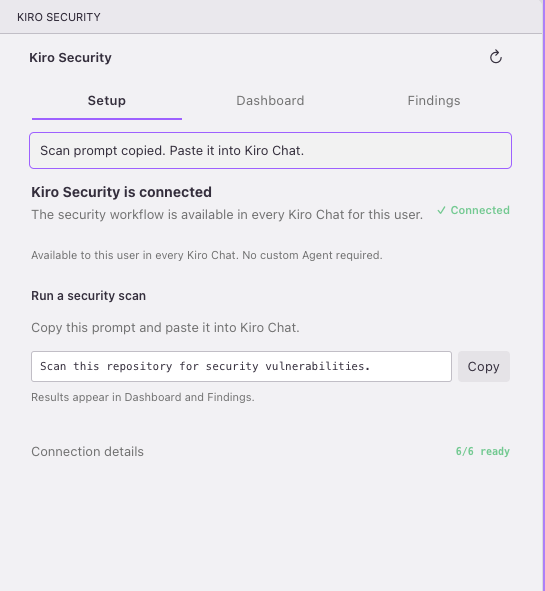
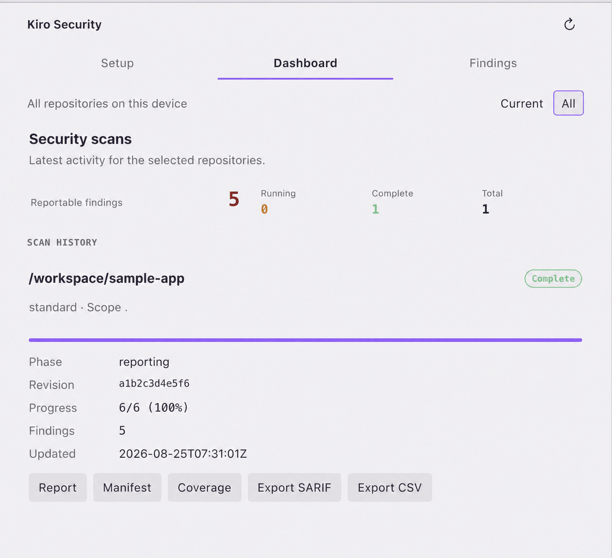
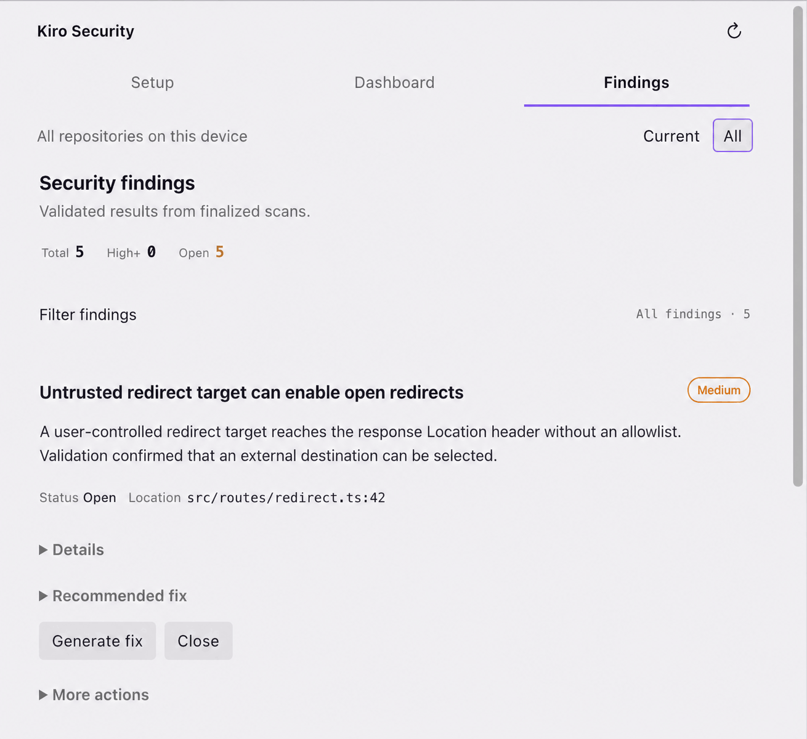

# Kiro Security

Run repository security scans from [Kiro](https://kiro.dev) Chat and review validated findings in a dedicated workbench.

**Alpha** · Apache-2.0

> Start in chat. Track progress, inspect findings, and continue the work without leaving Kiro.

## What you can do

- **Scan from chat** — Run Standard repository scans, Diff reviews for Git changes, or deeper multi-pass reviews.
- **Review validated findings** — Follow progress, filter and triage findings, and continue remediation or tracking work in Kiro Chat.
- **Keep useful outputs** — Open reports and export finalized results as JSON, SARIF, or CSV.

## Quick start

1. Install the extension and open **Kiro Security** from the activity bar.
2. Approve the one-time Kiro Chat connection.
3. Ask Kiro Chat: `Scan this repository for security vulnerabilities.`
4. Review the result in **Dashboard** and **Findings**.

## Requirements and control

- [Kiro](https://kiro.dev)
- Python 3.9 or newer
- Optional setting: `kiroSecurity.pythonPath` for a specific Python executable; leave it empty to auto-detect.

Setup preserves your existing Kiro configuration. Scan state and artifacts stay in extension global storage, outside the target repository, and the extension does not send them to an external service. Starting or canceling a scan always requires your approval.

Uninstalling the extension removes the Kiro Chat integration, and Kiro deletes its extension storage after restart.

## Project status

This is an early Alpha release. Features and saved scan data may change between versions.

Kiro Security is an independent open-source project, not an official OpenAI, Codex, or Kiro product. See [LICENSE-NOTICE.md](LICENSE-NOTICE.md) for provenance and [LICENSE](LICENSE) for the Apache License 2.0.
