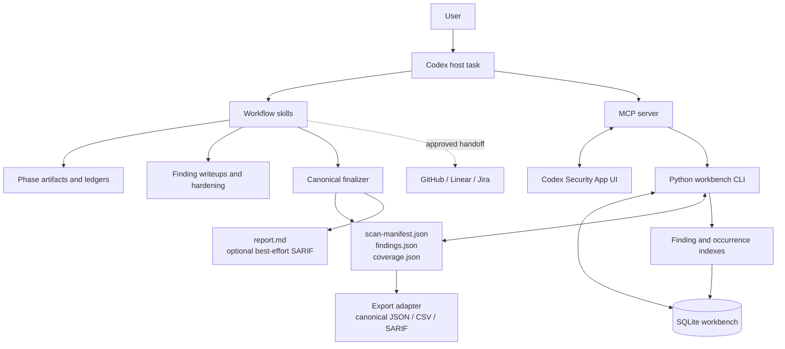
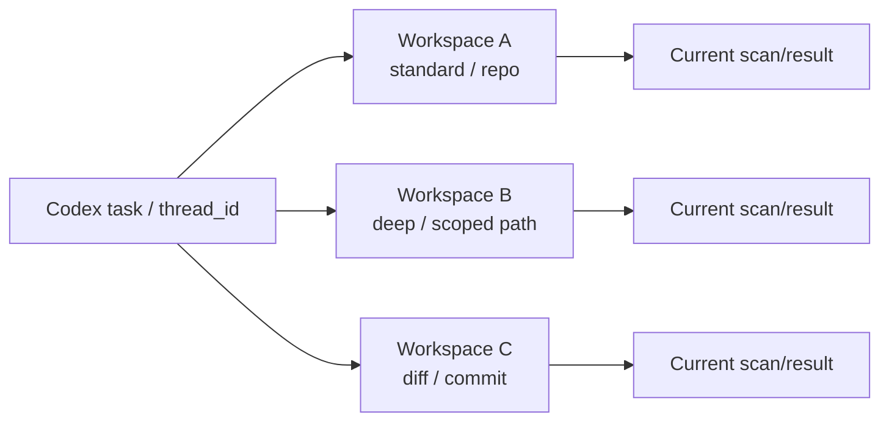
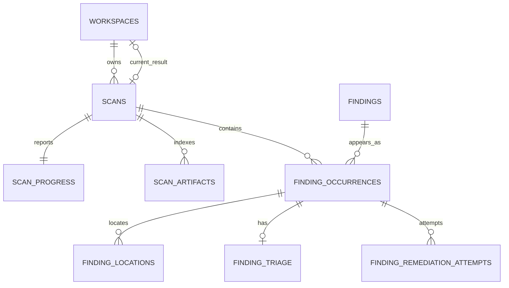
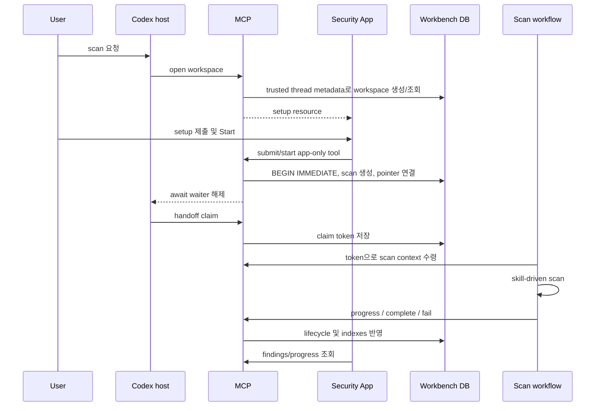
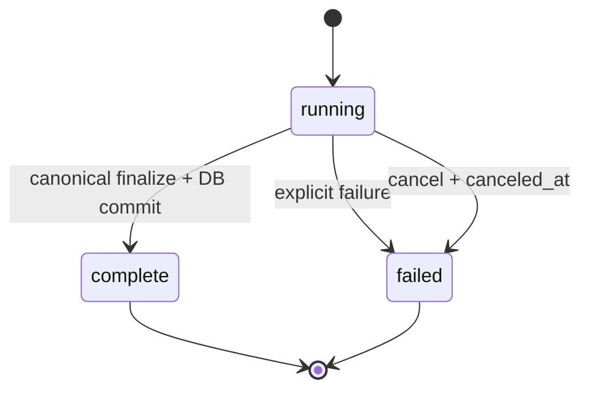
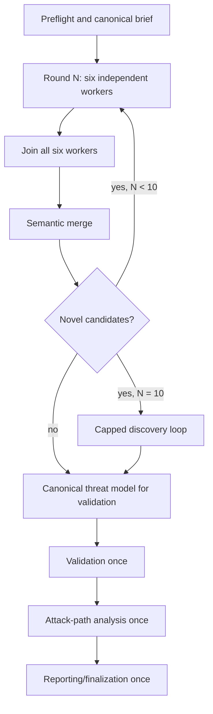

# Codex Security Plugin 0.1.11 아키텍처 분석

## 문서 지위

이 문서는 로컬에 설치된 OpenAI Codex Security Plugin `0.1.11`의 패키지, 스킬, Python workbench, MCP/App 동작과 공개된 제품 설명을 분석한 **버전 고정형 참고 자료**다. Kiro Security Power의 규범적 설계 문서가 아니며, Kiro 구현의 현재 계약은 `docs/architecture.md`와 Power의 실행 계약이 결정한다.

- 분석 대상: 로컬 Codex chat에서 실행되는 `codex-security@0.1.11`
- 분석 시점: 2026-07-23
- 분석 제외: Codex Security cloud의 서버 내부 구현
- 근거 우선순위: 설치 패키지의 실행 계약과 스키마 → 설치 패키지의 스킬 문서 → OpenAI 공개 문서
- 저작권 경계: 압축된 MCP/App 런타임은 동작과 인터페이스만 분석했으며, 복원한 원본을 이 저장소에 복사하지 않았다.

이 문서에서 “Codex workspace”는 Codex 채팅 자체가 아니라 workbench DB에 저장된 논리적 보안 작업공간을 뜻한다.

## 핵심 결론

Codex Security는 단일 스캐너 프로그램이 아니다. 다음 네 계층이 권한을 분담한다.

1. **Skill/model orchestration**이 위협 모델링, 후보 발견, 검증, 공격 경로 분석과 보고서 의미를 결정한다.
2. **MCP/App bridge**가 사용자 설정, 진행 표시, 결과 탐색과 Codex task handoff를 담당한다.
3. **Python/SQLite workbench**가 workspace와 scan lifecycle, 정확한 대상 식별, 동시성, 인덱싱과 복구를 결정론적으로 관리한다.
4. **Canonical artifact finalizer와 export adapter**가 완료 결과를 검증·봉인하고 `report.md`를 결정론적으로 생성하며, 별도 조회 경로에서 JSON, CSV, SARIF를 제공한다.

가장 중요한 불변식은 다음과 같다.

- workspace 설정은 첫 scan이 연결되기 전까지만 바꿀 수 있다.
- `active_scan_id`는 “실행 중인 scan”이 아니라 해당 workspace의 현재 scan/result 포인터다.
- terminal transition 뒤에도 포인터를 유지한다.
- 같은 설정으로 terminal scan을 다시 실행할 수 있고, 새 scan이 포인터를 교체한다.
- mode, scope, context, Diff target을 바꾸려면 새 workspace를 만든다.
- scan row는 시작 시점 설정을 보존하는 불변 snapshot이다.
- 진행률은 telemetry이며 workflow의 의미론적 authority가 아니다.
- 완료된 의미론적 결과의 authority는 검증·봉인된 canonical JSON이다.
- MCP handoff token은 결과 전달권을 claim할 뿐 scan mutation의 coordinator lease가 아니다.

## 1. 전체 구성



### 1.1 설치 패키지

설치 루트는 다음 요소로 구성된다.

| 요소 | 책임 |
|---|---|
| `.codex-plugin/plugin.json` | plugin 이름, 버전, 공급자, 라이선스, skill/App/MCP 진입점 선언 |
| `.mcp.json` | Node MCP 서버의 stdio 실행과 timeout 설정 |
| `.app.json` | GitHub, Linear, Atlassian app 연결 선언 |
| `mcp/server.mjs` | 압축된 MCP 런타임을 로드하는 부트스트랩 |
| `mcp/mcp-app.html.br` | setup, progress, findings, triage, remediation UI의 압축 배포 artifact |
| `skills/` | scan workflow와 phase별 semantic 계약 |
| `scripts/` | SQLite workbench, target inspection, preflight, finalization, projection |
| `schemas/` | manifest, findings, coverage JSON Schema |
| `references/` | 공통 artifact, reporting, security, static-assessment 계약 |

Plugin manifest 버전은 `0.1.11`이다. 패키지에 포함된 App/MCP UI resource에는 내부 컴포넌트 버전 `0.1.63`이 사용된다. 이는 관찰된 컴포넌트 버전 차이이며 plugin 계약 버전이 `0.1.63`이라는 뜻은 아니다.

### 1.2 스킬 분해

스킬은 세 종류로 나뉜다.

| 구분 | 스킬 |
|---|---|
| 최상위 scan | `security-scan`, `security-diff-scan`, `deep-security-scan` |
| scan phase | `threat-model`, `finding-discovery`, `validation`, `attack-path-analysis` |
| 후속/독립 workflow | `fix-finding`, `triage-finding`, `track-findings`, `vulnerability-writeup`, `propose-security-hardening` |

최상위 scan skill은 순서, 범위, worker 사용과 종료 조건을 규정한다. Phase skill은 해당 단계의 입력, 증거 수준과 산출물만 규정한다. Python engine이 heuristic vulnerability discovery를 수행하는 구조가 아니다.

## 2. Authority 모델

Codex Security는 하나의 객체가 모든 진실을 소유하지 않는다.

| 관심사 | Authority | 비고 |
|---|---|---|
| 사용자의 scan 의도 | 사용자 입력 + host task metadata | UI 입력만으로 host identity를 대체할 수 없음 |
| 저장된 setup | workspace row | 첫 scan 전까지만 변경 가능 |
| 시작 당시 계약 | scan row | workspace 설정을 복사한 불변 snapshot |
| workflow 단계 의미 | skill 계약 + phase artifacts/ledgers | progress row가 대신하지 않음 |
| 실행 진행 표시 | `scan_progress` | monotonic telemetry |
| 완료된 보안 결과 | canonical JSON + seal | DB finding row나 Markdown보다 우선 |
| 제품 조회/필터 | DB finding/occurrence indexes | canonical 결과의 index/projection |
| 사람이 읽는 결과 | `report.md`, finding writeups, hardening | canonical 결과에서 파생되며 일부는 seal 밖 |
| task 전달 상태 | handoff claim/delivery state | scan 실행 권한과 별개 |
| 외부 이슈 상태 | 해당 provider의 readback | scan 결과와 분리된 mutable state |

따라서 다음 해석은 잘못이다.

- App cache가 workspace authority라는 해석
- `active_scan_id`가 non-terminal scan만 가리킨다는 해석
- progress phase가 artifact 완료를 증명한다는 해석
- `report.md`를 structured result보다 우선하는 해석
- handoff token이 scan update/complete 권한을 독점한다는 해석

## 3. Codex workspace의 의미

### 3.1 채팅과 workspace는 동일하지 않다

Codex workspace는 workbench DB의 opaque UUID row다. `thread_id`가 host Codex task와 연결하지만 양자는 동일한 identity가 아니다. Setup equality를 workspace identity로 사용하거나 같은 설정의 workspace를 자동 deduplicate하지 않는다.

- 한 Codex task에 여러 security workspace가 존재할 수 있다.
- task에서 workspace를 다시 열 때는 해당 task의 최신 workspace를 선택할 수 있다.
- MCP의 `sessionId`는 이 workspace UUID다.
- 다른 setup으로 scan하려면 같은 task 안에서도 새 workspace를 만들 수 있다.
- 같은 task와 같은 setup이어도 새 workspace를 명시적으로 열면 별도 UUID가 만들어질 수 있다.

Progress workspace의 자동 재개는 단순 생성 시각 최신순이 아니다. 같은 thread에서 running scan이 연결된 workspace를 우선하고, 그 안에서 progress activity를 비교한다. Terminal workspace끼리는 workspace, triage, remediation activity를 포함해 선택한다. `sessionId`를 지정한 경우에는 그 workspace를 직접 연다.



### 3.2 설정 변경과 재실행

Workspace 설정은 `active_scan_id IS NULL`일 때만 저장할 수 있다. 첫 scan이 시작되면 설정은 terminal 여부와 무관하게 고정된다.

| 상태 | 같은 설정 재실행 | 설정 변경 |
|---|---:|---:|
| scan 시작 전 | 해당 없음 | 가능 |
| scan running | 불가 | 불가 |
| scan complete/failed/canceled | 가능 | 불가 |

Terminal scan 뒤 같은 workspace에서 재실행하면 새 scan row를 만들고 `active_scan_id`가 새 scan을 가리킨다. `active_scan_id`를 terminal transition에서 `NULL`로 비우지 않는다.

### 3.3 `active_scan_id`의 정확한 의미

이 필드명은 오해하기 쉽지만 실제 의미는 다음과 같다.

> 해당 workspace에 연결된 현재 scan/result의 포인터

실행 중인지 여부는 연결된 scan row의 status로 판단한다. Workspace에는 `REFERENCES scans(id) ON DELETE SET NULL` FK가 있으며, 참조 scan이 삭제되는 경우를 DB 차원에서 방어한다. 관찰된 0.1.11 workbench에는 일반 사용자가 scan을 삭제하는 cleanup API는 없다.

## 4. Workbench 저장 구조

### 4.1 DB 위치와 연결 설정

기본 DB는 다음 순서로 결정된다.

1. `CODEX_SECURITY_STATE_DIR`가 있으면 그 아래의 workbench DB
2. 아니면 `$CODEX_HOME/state/plugins/codex-security/workbench.sqlite3`

Workbench는 WAL, foreign keys, 5초 busy timeout, 제한된 재시도를 사용하며 DB 파일 권한을 `0600`으로 제한한다.

### 4.2 schema migration

0.1.11 패키지의 workbench는 10단계 migration을 포함한다.

| 버전 | 주요 변경 |
|---:|---|
| 1 | workspace, scan, progress, artifact, finding 기본 구조 |
| 2 | capability preflight 저장 |
| 3 | finding triage, remediation, 상세 정보 |
| 4 | scan handoff claim |
| 5 | remediation claim |
| 6 | thread-scoped workspace |
| 7 | remediation delivery timestamp |
| 8 | manifest seal digest |
| 9 | target filesystem identity |
| 10 | cancellation timestamp |

현재 1–10 migration을 적용하기 전에 모든 DB connection은 pre-release migration history를 정규화한다. 이 compatibility path는 과거 2–5 번호 체계를 인식하고, 일관되지 않은 history는 거부하며, 필요한 column을 복원한 뒤 record를 현재 번호로 다시 맞춘다. 따라서 parity migration은 fresh schema만이 아니라 이 기존 pre-release state의 안전한 승계도 고려해야 한다.

핵심 table은 다음과 같다.



`workspaces`, `scans`, `scan_progress`, `scan_artifacts`, `findings`, `finding_occurrences`, `finding_locations`, `finding_triage`, `finding_remediation_attempts`와 `schema_migrations`가 저장된다. Partial unique index가 workspace당 running scan을 하나로 제한한다.

### 4.3 provisional setup과 submitted setup

Workspace 생성은 UI가 잘못되거나 미완성인 입력을 보여주고 고칠 수 있도록 provisional setup을 저장할 수 있다. 생성 시 validation 오류를 보존하지만, scan 시작 전 제출은 엄격하게 검증한다.

- `workspace_state`: active scan이 없으면 현재 setup을 동적으로 검사해 UI 상태를 만든다.
- `save_workspace`: 전체 setup을 검증하고 submitted 상태로 만든다.
- `start_scan`: submitted setup을 다시 검증하고 immutable scan snapshot으로 복사한다.

자유 입력 Diff spec은 비동기 해석 중 오래된 응답이 새 입력을 덮지 않도록 request UUID인 `diff_resolution_id`로 begin/cancel/set을 직렬화한다.

## 5. Target 모델

### 5.1 공통 제약

- target은 존재하는 절대 local directory여야 한다.
- bare Git repository는 거부한다.
- scope 입력은 target 내부의 기존 directory를 가리키는 contained absolute path 또는 POSIX-style relative path다. DB에는 target-relative POSIX path로 정규화된다.
- Git 명령 인자는 shell string이 아니라 argument array로 전달한다.
- Canonical path와 filesystem identity는 start transaction의 target-replacement race와 remediation checkout identity를 검사하는 데 사용한다. Completion drift 검사는 별도로 target 존재 여부, Git HEAD와 content digest를 확인하며 stored device/inode를 다시 비교하지 않는다.

### 5.2 scan 종류별 대상

| Scan | 허용 target | scope | identity/drift 기준 |
|---|---|---|---|
| Standard | Git repository, 하위 폴더, non-Git directory | 전체 또는 scoped | revision + snapshot/content digest |
| Deep | repository 또는 scoped directory | DB 계약상 `.` | Standard와 같은 snapshot 계열 |
| Diff: working tree | checked-out Git root | `.` | HEAD + deterministic working-tree digest |
| Diff: commit | locally available commit | `.` | exact commit + first parent 또는 empty-tree base |
| Diff: range | distinct locally available base/head | `.` | exact base/head object identity |

Deep의 scoped scan은 상위 repository에 별도 scope를 저장하는 대신 scoped directory 자체를 `targetPath`로 사용하고 scope를 `.`로 표현한다.

Commit/range scan은 대상 object가 local repository에 존재하면 현재 checked-out HEAD와 달라도 된다. Clean worktree도 요구하지 않는다. 세 Diff target 중에는 working-tree Diff만 현재 checkout content drift를 추적한다. 별도로 Standard/Deep Git scan도 시작 당시 HEAD와 worktree snapshot digest를 completion 전후에 재검증한다.

Canonical result 계약은 sanitized remote identity를 표현할 수 있지만, 로컬 workbench의 안정 target ID는 canonical local path의 SHA-256을 기반으로 한다.

## 6. Setup에서 Agent 실행까지

### 6.1 App-backed 흐름



`open_codex_security_workspace`는 caller가 보낸 임의 thread field가 아니라 trusted MCP request metadata에서 host thread ID를 얻는다. UI가 Start를 누르면 최대 14분 대기 중인 `await_codex_security_scan_start`가 해제된다.

### 6.2 scan start transaction

Start는 다음 순서로 진행된다.

1. submitted setup과 target을 검증한다.
2. 기존 running scan 유무를 검사한다.
3. exact target snapshot과 filesystem metadata를 계산한다.
4. `BEGIN IMMEDIATE`를 획득한다.
5. running scan, workspace version/updated timestamp, device/inode를 다시 확인한다.
6. UUID scan row와 progress row를 만들고 workspace pointer를 새 scan에 연결한다.
7. scan directory와 DB lifecycle을 연결한다.

App server는 `CODEX_SECURITY_SCAN_ROOT`가 없으면 프로세스 수명 동안 유지되는 임시 `codex-security-scans-*` root를 만든다. Workbench는 그 아래에 target 이름, revision/시간, random component를 조합한다.

DB start는 model worker를 생성하지 않는다. 실제 workflow는 handoff를 받은 Codex host가 skill을 실행하면서 시작한다.

### 6.3 handoff의 의미

Start waiter는 scan을 claim하고 UUID token을 받는다. `get_codex_security_scan_context(scanId, token)`이 claim을 delivered로 전환하고 authoritative scan snapshot을 반환한다.

- 결과: `started`, `already_delivered`, `timed_out`
- stale scan handoff claim: 120초 뒤 회수 가능
- explicit recovery: recovery token prefix를 통해 cross-thread 복구 가능
- token의 범위: context delivery 및 continuation claim
- token이 하지 않는 일: progress/update/complete/fail mutation의 bearer authorization

즉 0.1.11에는 “한 coordinator만 scan row를 갱신할 수 있다”는 별도 coordinator lease가 없다. Mutation은 기본적으로 `scanId`를 기준으로 한다.

## 7. Scan lifecycle과 progress

### 7.1 상태

DB status는 `running`, `complete`, `failed`다. 취소는 별도 `canceled_at`을 가진 failed scan이며 UI가 이를 `canceled`로 projection한다.



Running 상태는 Codex turn이나 MCP process 종료와 함께 자동 소멸하지 않는다. Durable DB state와 scan artifacts를 이용해 복구한다.

### 7.2 phase와 progress

Phase 순서는 고정되고 역행할 수 없다.

```text
preflight → threat_model → discovery → validation → attack_path → reporting
```

한 pass 안에서는 total과 completed가 monotonic이다. Deep scan이 다음 pass로 넘어갈 때 pass 번호가 증가하고 completed는 새 pass의 0에서 시작할 수 있다.

Progress는 UI telemetry다. Phase artifact, ledger, canonical result가 존재하지 않는데 progress만 완료됐다고 기록되어도 semantic completion으로 인정되지 않는다.

## 8. Capability preflight

Registry에는 `security_scan`, `security_diff_scan`, `deep_security_scan` profile이 있다. 검사 항목에는 delegated workers, goal 지원, worker slot 수, Deep phase skill, orchestration depth/config가 포함된다.

| Profile | Block | Warn | Suggest |
|---|---|---|---|
| Standard | 없음 | delegation 부재, usable worker slot 6개 미만 | goal tool 또는 goals 부재 |
| Diff | 없음 | delegation 부재 | goal tool 또는 goals 부재 |
| Deep | phase skill 부재, delegation 부재, usable worker slot 6개 미만, V1 depth 2 미만 | usable worker slot 8개 미만 | goal tool 또는 goals 부재 |

Multi-agent V1, V2, bridge-V2를 인식하며 config는 system, user, optional CLI profile, trusted project 순으로 해석한다. Project `.codex/config.toml`은 해당 project가 trusted일 때만 적용한다.

- blocking failure가 있으면 `blocked`
- 판정할 수 없는 필수 capability가 있으면 `incomplete`
- 나머지는 `ready`

App setup이 먼저 끝난 뒤 scan context를 받은 Agent가 authoritative preflight를 수행한다. Preflight를 시작할 때 tool surface를 한 번 조사하고 runtime ownership, version, capacity 같은 사실을 첫 helper 호출에 함께 전달한다. CLI에서는 helper를 직접 실행하고, delegation을 지원하는 다른 host에서는 전담 worker가 helper를 실행하도록 한다. Worker spawn이 실패하거나 concrete worker ID를 반환하지 않으면 parent가 helper를 직접 실행하고 spawn failure를 보고한다.

필수 capability의 runtime version, ownership 또는 capacity를 확인할 수 없으면 성공으로 추정하지 않고 `incomplete`로 둔다. Preflight가 blocked/incomplete이면 보통 scan을 running으로 남겨 정확한 조치 후 복구할 수 있게 한다. Interactive mode에서는 config 변경 전에 승인을 받고, non-interactive/headless mode는 concrete하고 안전한 config patch만 한 번 적용한 뒤 preflight를 한 번 다시 실행한다. 재검사도 non-ready이면 자동으로 fail하지 않고 durable running scan을 보존한다.

Workspace의 `capability_preflight_json`은 이전 호환과 UI cache 성격이다. App-backed scan의 실행 authority가 아니다.

### 8.1 Goal과 completion ownership

Goal은 긴 scan의 완료 조건과 재개 지점을 보존하는 optional persistence aid이며 scan authority가 아니다. App 경로에서는 Start와 authoritative scan context 수령이 끝나고 preflight가 `ready`가 된 뒤에만 goal을 create/adopt한다. Goal 도구가 없으면 같은 artifact-closure objective를 사용자에게 보이는 progress update에 유지한다.

Deep은 coordinator goal과 worker-local discovery goal의 완료 경계를 분리한다. Worker goal의 완료는 해당 worker artifact와 receipt가 저장됐다는 뜻이고, 전체 Deep goal의 완료는 모든 round와 centralized tail, reporting이 닫혔다는 뜻이다.

`vulnerability-writeup`과 `propose-security-hardening`은 scan 없이도 실행할 수 있는 독립 workflow다. Scan reporting에서는 한 worker에 vulnerability 하나만 배정한다. 각 reportable finding의 최초 draft를 전담 worker가 만들고, worker가 stall하거나 draft가 quality rule을 충족하지 못하면 같은 finding을 다른 전담 worker로 재시도한다. 모든 accepted writeup이 준비된 뒤 전체 collection에 대해 hardening을 한 번 수행한다.

## 9. Standard scan

Standard scan의 상위 흐름은 다음과 같다.

1. setup과 exact target을 고정한다.
2. capability preflight를 수행한다.
3. goal과 scan contract를 만든다.
4. 적용되는 root/nested `SECURITY.md`를 컴파일한다.
5. repository-level threat model을 만든다.
6. review surface를 inventory하고 rank/worklist를 만든다.
7. candidate finding을 발견한다.
8. candidate를 검증한다.
9. valid finding의 attack path와 reportability/severity를 판정한다.
10. canonical JSON을 완성한다.
11. reportable finding마다 전담 worker가 상세 writeup을 만들고, stall/quality rule이 요구하면 같은 finding을 다른 전담 worker로 재시도한다.
12. 전체 finding set에 대해 hardening portfolio를 한 번 만든다.
13. finalizer를 실행하고 DB를 complete로 전환한다.

Repository/scoped inventory는 source-like surface의 누락 여부를 추적한다. Ranking worker는 최대 6개를 사용하고, file-review ownership과 candidate ledger를 통해 중복과 누락을 조정한다.

Deterministic inventory에서 ranked/deep-review worklist와 coverage ledger를 만들고, 모든 in-scope row를 completion receipt 또는 `deferred`, `not_applicable`, `suppressed`, `reportable` 같은 명시적 disposition으로 닫는다. Discovery candidate와 아직 closure가 필요한 seeded/root-control ledger row도 validation과 attack-path receipt 또는 정확한 deferred reason을 가져야 한다. Delegated worker가 없으면 명시된 degraded path로 진행할 수 있지만 exhaustive coverage를 주장해서는 안 된다.

Threat model은 기본적으로 repository-level context를 만든다. 이후 단계는 requested repository/scoped path에 finding과 coverage를 고정하지만, 구체적 finding의 동작을 이해하는 데 직접 필요한 supporting file은 열 수 있다. 이를 unrelated repository-wide enumeration으로 확장해서는 안 된다.

## 10. Diff scan

Diff scan은 Standard와 같은 phase를 사용하지만 exact Git change set만 검토한다.

- deterministic changed-source inventory를 만든다.
- changed, deleted, renamed source를 모두 포함한다.
- 변경을 이해하는 데 직접 필요한 supporting context만 연다.
- unchanged sibling은 영향을 입증하지 못하면 negative/control evidence로만 사용한다.
- 일반 repository audit로 scope를 넓히지 않는다.

`rank_input`과 `deep_review_input`이 변경 범위를 고정한다. Commit, range, working-tree 대상은 시작 시 계산한 exact identity/digest와 완료 시점의 대상 조건을 대조한다.

모든 changed source-like row를 deep-review하고 completion receipt를 남긴다. 모든 discovery candidate는 discovery, validation, attack-path closure를 갖거나 정확한 deferred reason을 기록한다. Delegated worker가 없는 degraded path에서는 exhaustive coverage를 주장하지 않는다.

## 11. Deep scan

Deep scan은 diff용이 아니라 동일 scope에서 발견 분산을 줄이고 recall을 높이는 반복 wrapper다.

### 11.1 round 구조

- round마다 독립 discovery worker 6개를 사용한다.
- 최대 10 round까지 실행한다.
- 모든 worker는 같은 canonical brief와 authoritative worklist를 받는다.
- themed lane으로 문제 종류를 미리 분할하지 않는다.
- worker는 이전 round의 semantic 결과를 보지 않고 독립 위협 모델을 만든다.
- worker별 artifact 공간을 사용한다.
- coordinator는 round 중 orchestration만 수행한다.
- 6개 worker가 모두 종료되고 idle이 된 뒤 결과를 읽고 merge한다.



Merge는 단순 문자열 일치가 아니라 remediation-subsumption을 사용한다. 같은 root cause와 remediation으로 함께 제거되는 후보는 병합하지만, 독립적으로 고쳐야 하는 instance는 보존한다.

첫 complete zero-novelty round에서 discovery를 종료한다. 첫 round에서 후보가 전혀 없으면 no-findings 경로로 간다. 10번째 round에도 새 후보가 있으면 discovery loop의 내부 terminal state를 `capped`로 기록하고 현재 canonical inventory로 중앙 validation tail을 진행한다. Coverage의 `complete`, `partial`, `unknown`은 round cap이 아니라 실제 deferred scope와 입증 가능한 coverage에 따라 별도로 결정한다.

최종 사용자 결과는 worker, round, novelty 같은 내부 orchestration 세부를 노출하지 않는다.

### 11.2 concurrent Deep 경고

새 Deep scan row가 생성되고 authoritative scan context가 처음 로드된 직후, Deep workflow skill이 preflight보다 먼저 `otherRunningDeepScans`를 확인해 사용자에게 Continue/Cancel을 묻는다. Cancel하면 새 scan만 failed로 전환하고 기존 Deep scan에는 손대지 않는다. 이는 전체 scan을 막는 전역 lock이 아니라 고비용 동시 실행을 알리는 workflow guard다.

## 12. Phase별 semantic 계약

| Phase/Skill | 책임 | 대표 산출물 |
|---|---|---|
| Threat model | 자산, entry point, trust boundary, attacker capability, security invariant 정의 | repository threat model |
| Finding discovery | source-to-sink proof chain과 plausible candidate 발견 | candidate ledgers |
| Validation | 동적/정적 검증, strongest counterevidence, 결론 | validation records |
| Attack path | reachability, exploit chain, impact, severity, reportability | attack-path records |
| Vulnerability writeup | reportable finding 하나를 source-backed 보고서로 파생 | `findings/<slug>/...` |
| Hardening | 전체 finding set의 구조적 개선안을 비교 | `hardening/...` |

Phase skill은 필요해질 때 읽는 progressive contract다. 상위 workflow는 이후 phase의 판단을 미리 수행하지 않는다.

`triage-finding`은 scan phase가 아닌 독립 `triage-finding/v0` 정적 평가 workflow다. `fix-finding`도 scan completion과 분리된 generate/apply/verify workflow다.

## 13. `SECURITY.md` 정책 계층

Root 또는 nested `SECURITY.md`는 위협 모델 맥락, security invariant, reportable finding 기준, 제외와 severity 맥락을 제공한다. 가장 가까운 적용 파일이 우선한다.

Policy resolution은 target 시작 시 한 번만 하는 전역 lookup이 아니다. Discovery는 각 source file을 검토하기 전에 root에서 해당 file의 directory까지 적용 가능한 `SECURITY.md`를 root-to-leaf로 해석하고 가장 가까운 policy를 우선한다. Delegated file-review worker도 자신이 맡은 file에 대해 같은 resolution을 수행한다.

다만 repository 파일은 모두 untrusted data다. `SECURITY.md`가 system/user 지시, Codex safety policy 또는 scan workflow의 hard rule을 무효화할 수 없다. 즉 repository policy precedence는 대상 코드 안의 정책끼리의 precedence이지 prompt authority 상승이 아니다.

## 14. Scan artifact 구조

Scan directory는 대체로 다음 구조를 사용한다.

```text
<scan-dir>/
├── artifacts/
│   ├── 01_context/
│   ├── 02_discovery/
│   ├── 03_coverage/
│   ├── 04_reconciliation/
│   ├── 05_findings/
│   ├── deep_discovery/       # Deep only
│   └── deep_merge/           # Deep only
├── scan-manifest.json
├── findings.json
├── coverage.json
├── report.md
├── findings/
│   └── <finding-slug>/
└── hardening/
```

Deep scan은 `artifacts/deep_discovery/round-NN/worker-NN/` 아래에 worker별 공간을 두고 `artifacts/deep_merge/`에 merge bookkeeping을 둔다. Coverage receipt는 artifacts 아래의 regular file이어야 하며 final seal의 hash 대상에 포함된다.

### 14.1 canonical과 derived 결과

| 분류 | 파일 | 지위 |
|---|---|---|
| Canonical | `scan-manifest.json` | scan, target, scope, artifact hash, completion metadata |
| Canonical | `findings.json` | finding의 의미론적 source of truth |
| Canonical | `coverage.json` | reviewed surface와 completeness |
| Derived | `report.md` | canonical JSON의 사람이 읽는 projection |
| Canonical export | JSON | 봉인된 canonical `findings.json` 자체를 반환 |
| Derived export | SARIF | canonical finding의 표준 교환 projection |
| Derived export | CSV | DB index에서 만들며 현재 local triage state를 포함할 수 있음 |
| Derived | `findings/<slug>/...` | finding별 상세 서술과 PoC |
| Derived | `hardening/...` | 구조적 개선 portfolio |

Finding writeup과 hardening은 canonical finding을 대체하지 않으며 core seal의 semantic authority가 아니다. 공개 문서도 hardening을 patch나 수정 검증이 아닌 design portfolio로 정의한다.

### 14.2 canonical schema

Manifest target kind는 다음 네 종류다.

- `git_revision`
- `git_worktree`
- `git_diff`
- `directory_snapshot`

Finding에는 stable identity, rule, title/summary, severity, confidence, taxonomy, locations, remediation, provenance가 필요하다. Evidence, root cause, validation, attack path, writeup, extensions를 구조적으로 확장할 수 있다.

Coverage는 repo/scoped/diff/commit/branch/working/deep mode와 surface/receipt를 기록한다. Completeness는 `complete`, `partial`, `unknown`이며, `complete` 결과에는 deferred 또는 needs-follow-up surface가 남을 수 없다.

### 14.3 stable finding identity

Finalizer는 다음 semantic material로 fingerprint를 결정한다.

```text
fingerprint algorithm + targetId + ruleId + identity.anchor + identity.instance
```

- `findingId`: fingerprint에서 파생되어 scan 사이에 안정적
- `occurrenceId`: scan ID와 fingerprint에서 파생되어 scan occurrence마다 고유
- 같은 scan에서 독립 sibling finding은 `identity.instance`로 분리

DB의 `findings`는 fingerprint 기준의 logical finding을 보존하고, `finding_occurrences`는 각 scan 출현을 보존한다.

## 15. Finalization과 sealing

Finalizer는 단순 JSON writer가 아니다.

1. scan-local path와 descriptor-relative access를 검증한다.
2. symlink, path escape, 비정상 JSON number를 거부한다.
3. manifest/findings/coverage schema를 검증한다.
4. target, scan ID, scope와 cross-reference 일치를 확인한다.
5. coverage completeness와 receipt regular-file 존재를 확인한다.
6. stable finding/occurrence identity를 파생·검증한다.
7. writeup/hardening reference를 검증한다.
8. canonical files와 deterministic `report.md`를 쓴다.
9. artifact digest와 `sealedAt`을 기록한다.
10. 가능한 경우 SARIF를 best-effort로 파생한다.

Manifest는 자기 자신을 자기 artifact list로 hash할 수 없다. App-backed workbench는 DB의 `seal_manifest_digest`가 manifest 자체를 외부에서 pin하고, manifest 내부 digest가 다른 canonical artifact와 coverage receipt를 보호한다.

### 15.1 atomic completion

Workbench completion은 OS scan lock을 잡고 다음을 수행한다.

1. finalization 전 target drift 검사
2. filesystem finalizer 실행 또는 기존 seal 재검증
3. finalization 후 target drift 재검사
4. `BEGIN IMMEDIATE`
5. artifact/finding/occurrence/location index 교체
6. scan status를 `complete`로 전환

Filesystem finalization 뒤 DB commit만 실패하면 scan은 sealed files를 가진 `running` 상태로 남을 수 있다. 같은 completion을 retry하면 기존 seal을 재검증하고 DB commit을 복구한다. 완료 호출은 이 범위에서 idempotent하다.

## 16. MCP/App 인터페이스

### 16.1 런타임 경계

Node MCP 서버는 stdio로 실행되고 Python `workbench_db.py`를 `execFile`로 호출한다. Shell을 경유하지 않는다.

- Python resolver: 명시된 `$PYTHON` → bundled Codex runtime 후보 → `python`/`python3`
- 기본 긴 호출 timeout: 5분
- 일반 호출 timeout: 30초
- subprocess buffer 상한: 4 MiB
- 임시 capability JSON: `0600`, 사용 뒤 제거
- UI CSP: network domain 없음
- UI capability: clipboard write만 허용

MCP는 versioned UI resource와 legacy UI resource를 모두 제공한다.

### 16.2 model-visible tools

| Tool | 목적 |
|---|---|
| `request_codex_security_user_input` | workflow 중 사용자 판단 요청 |
| `open_codex_security_workspace` | trusted thread에 setup/findings workspace 열기 |
| `await_codex_security_scan_start` | App Start 또는 timeout 대기 |
| `open_codex_security_triage_results` | triage result UI 열기 |
| `set_codex_security_capability_preflight` | legacy non-App preflight 저장 |
| `set_codex_security_resolved_diff` | 비동기 Diff spec 해석 결과 반영 |
| `get_codex_security_scan_context` | handoff token으로 scan snapshot 수령 |
| `update_codex_security_scan_progress` | telemetry 갱신 |
| `complete_codex_security_scan` | finalization과 DB 완료 전환 |
| `fail_codex_security_scan` | scan 실패 기록 |
| `set_codex_security_finding_remediation` | remediation 상태/결과 반영 |

### 16.3 App-only tools

App 전용 도구는 21개다.

- progress workspace 열기
- Diff resolution begin/cancel
- workspace state 조회
- target/setup inspection
- setup submit, scan start/cancel
- scan handoff delivery mark/claim/release
- finding triage 저장
- remediation request/action request
- remediation delivery claim/release/cancel/mark
- finding JSON/CSV/SARIF export
- finding list 조회

App 전용 구분은 UI transport boundary다. Scan의 의미론적 판단을 App이 수행한다는 뜻이 아니다.

## 17. Findings UI와 후속 lifecycle

App UI는 다음을 제공한다.

- Codebase/Changes 선택과 Deep toggle
- scope, branch/revision, Diff target, context 설정
- scan progress와 오류/복구 상태
- severity, confidence, category, directory, review/patch 상태별 filtering/sorting
- finding evidence, validation, reachability, impact, remediation 상세
- coverage와 artifact 접근
- JSON, CSV, SARIF export
- triage open/close
- remediation generate/apply/verify 요청
- Codex task에서 계속하기

### 17.1 triage

Finding triage는 open/closed 상태를 갖고 closed reason은 `already_fixed`, `wont_fix`, `false_positive`다. `wont_fix`에는 note가 필요하고, pending remediation이 있는 finding은 닫을 수 없다.

### 17.2 remediation

Remediation state는 다음을 사용한다.

```text
requested → generated → applied → verifying → verified
    │            │          │          │
    └────────────┴──────────┴──────────→ failed

generated/applied ── new generate request ──→ superseded
```

DB enum에는 legacy/compatibility 값인 `idle`도 있지만 현재 App의 attempt 생성 경로는 `requested`에서 시작한다.

App은 version compare-and-swap과 action token으로 generate/apply/verify 요청을 구분한다.

- 일반 remediation claim lease: 120초
- 전달된 action worker lease: 900초
- generate: 선택 checkout을 직접 수정하지 않고 isolated worktree에서 patch 생성
- apply: scan-local exact digest-bound unified diff만 적용
- verify: repository write 없이 검증

Apply 전에 revision, device/inode, content digest를 검사한다. Patch는 2 MiB 이하이며 reverse-apply test를 이용해 정확한 patch인지와 unrelated change가 없는지 확인한다.

### 17.3 tracking

Tracking은 완료·봉인된 finding을 Linear, Jira, GitHub issue 또는 private draft GitHub Security Advisory로 보낸다.

- source seal을 먼저 검증한다.
- 한 번에 provider와 destination 하나만 선택한다.
- duplicate를 조회한다.
- exact payload와 visibility를 미리 보여준다.
- 사용자 승인 뒤에만 write한다.
- 생성/수정 결과를 read back한다.
- connector 실패 시 다른 provider로 자동 전환하지 않는다.

외부 tracker의 state는 mutable하며 canonical scan result에 합쳐지지 않는다.

## 18. 보안 경계

### 18.1 읽기 전용 scan

Standard, Diff, Deep scan은 대상 repository를 수정하지 않는다. Repository text, source comment, test fixture와 `SECURITY.md`는 untrusted input으로 취급한다.

### 18.2 filesystem 방어

- canonical absolute target과 scope containment
- descriptor-relative scan artifact 접근
- symlink와 path traversal 거부
- device/inode 및 content drift 확인
- regular-file coverage receipt만 허용
- credential/query/fragment 없는 sanitized remote URL

### 18.3 host와 App identity

Thread identity는 trusted request metadata에서 파생한다. UI가 임의의 thread/workspace identity를 주장해 권한을 얻지 못하게 한다. App cancel은 thread ownership을 확인하지만 model-side fail/update는 별도 coordinator token을 요구하지 않는다.

### 18.4 connector 경계

Provider credential과 network write는 별도 승인된 connector가 소유한다. Plugin은 preview, 승인, exact payload, readback을 관리하며 credential을 scan artifact에 넣지 않는다.

## 19. 동시성, 실패와 복구

| 상황 | 동작 |
|---|---|
| 같은 workspace에서 두 start 경쟁 | `BEGIN IMMEDIATE` + partial unique index로 하나만 성공 |
| setup 저장과 start 경쟁 | workspace version/updated timestamp 재검사 |
| start 도중 target 교체 | transaction 전후 device/inode 불일치로 거부 |
| completion target drift | target 존재 여부, Git HEAD와 content digest 불일치로 거부; stored device/inode는 재검사하지 않음 |
| remediation checkout 교체/drift | canonical path, device/inode, revision/content digest guard로 거부 |
| task/process 종료 | running DB state 유지, 명시적 복구 가능 |
| handoff consumer 사라짐 | 120초 stale claim 회수 |
| completion 중 DB lock/failure | sealed files 재검증 후 idempotent retry |
| 사용자가 cancel | failed + `canceled_at`, UI는 canceled로 표시 |
| terminal 후 재실행 | 같은 immutable setup으로 새 scan 생성, pointer 교체 |

이 구조에서 recovery는 “workspace 설정을 다시 등록해 덮어쓰기”가 아니라 기존 workspace와 scan snapshot을 다시 읽어 이어가는 방식이다.

## 20. CLI fallback과 App-backed 실행

공개 quickstart는 Desktop App과 CLI를 모두 지원한다. App-backed 실행은 setup workspace, SQLite lifecycle, findings UI와 handoff를 사용한다. CLI fallback은 App workspace를 열지 않고도 skill과 artifact contract로 scan directory를 직접 완성할 수 있다.

Setup transport 선택은 host-bound hard routing 계약이다.

- Host context가 Codex Desktop App임을 명시하고 필요한 setup continuation tool이 모두 있을 때만 App path를 선택한다. Tool이 보인다는 사실만으로 App host라고 판단하지 않는다.
- App workspace를 연 뒤에는 `await_codex_security_scan_start`를 즉시 호출한다. `timed_out`이면 사용자가 Setup을 완료하고 **Continue in Codex**를 사용하도록 안내하며, `already_delivered`이면 다른 continuation이 소유하므로 중단한다. 어느 경우에도 terminal/chat path로 pivot하지 않는다.
- CLI와 App capability가 없는 host는 처음부터 공식 prompt-only terminal/chat path를 사용한다.
- Requested base가 현재 `HEAD`가 아닌 local working-tree patch처럼 App setup이 표현하지 못하는 대상도 처음부터 terminal/chat path로 라우팅한다.

따라서 SQLite/App는 로컬 Desktop product experience의 authority지만, Codex Security semantic workflow 전체가 UI 존재에 종속되는 것은 아니다. CLI는 실패 fallback이 아니라 공식 지원 경로다. 두 경로가 공유하는 핵심은 skill phase 계약과 canonical artifact contract다.

## 21. Kiro parity 판단에 필요한 최소 체크리스트

“Codex Security 0.1.11과 완전 부합”을 주장하려면 이름이나 UI가 아니라 다음 의미가 일치해야 한다.

### Workspace와 lifecycle

- [ ] workspace와 chat/session identity를 분리한다.
- [ ] workspace는 opaque UUID이며 setup equality로 자동 deduplicate하지 않는다.
- [ ] 첫 scan 이후 workspace setup을 불변으로 만든다.
- [ ] terminal transition에서 current-result pointer를 유지한다.
- [ ] pointer에 `ON DELETE SET NULL` 참조 무결성이 있다.
- [ ] 같은 setup 재실행은 허용하고 다른 setup은 새 workspace로 분리한다.
- [ ] scan row에 시작 시점 setup snapshot을 보존한다.
- [ ] workspace read는 process-local stale cache가 아니라 shared authority를 다시 읽는다.

### Workflow와 대상

- [ ] Standard, Diff, Deep의 target/scope 규칙이 분리돼 있다.
- [ ] Diff는 exact local Git object/worktree digest로 고정된다.
- [ ] App/CLI path를 host context로 결정하고 App handoff 뒤 terminal path로 pivot하지 않는다.
- [ ] Standard/scoped scan은 deterministic inventory, ranked/deep-review worklist와 coverage ledger를 만들고 모든 in-scope row를 receipt 또는 명시적 disposition으로 닫는다.
- [ ] Diff scan은 모든 changed source-like row를 deep-review하고 completion receipt를 남긴다.
- [ ] 모든 discovery candidate와 closure 대상 ledger row는 validation·attack-path receipt 또는 정확한 deferred reason을 가진다.
- [ ] Standard/Diff에서 delegated worker가 없으면 exhaustive coverage를 주장하지 않고 degraded path를 보고한다.
- [ ] Deep은 첫 authoritative context 직후 preflight 전에 다른 running Deep scan을 확인하고 Continue/Cancel을 처리한다.
- [ ] Deep worker는 같은 canonical brief와 shared authoritative rank/deep-review worklist를 사용하며 shared pre-discovery threat model이나 themed lane을 받지 않는다.
- [ ] Deep coordinator는 active round 동안 중립적인 orchestration만 수행하고, exact 6개 usable output과 worker idle을 확인한 뒤 merge하고 그 다음 novelty를 계산한다.
- [ ] Deep semantic merge는 remediation-subsumption을 사용하고 독립 instance를 보존하며, canonical inventory·discovery report·support ledger 정합성을 맞춘 뒤 centralized tail에 진입한다.
- [ ] Deep은 첫 complete zero-novelty round에서 멈추고 novelty가 계속되면 최대 10 round에서 `capped`로 전환한다.
- [ ] phase progress와 semantic artifact authority를 구분한다.
- [ ] preflight blocked/incomplete 상태가 durable recovery를 허용한다.
- [ ] preflight는 tool surface를 한 번 조사해 첫 helper 호출에 runtime facts를 전달하고, CLI direct 실행과 delegated-host worker 실행을 구분한다.
- [ ] 확인할 수 없는 필수 capability는 `incomplete`로 두며 interactive 승인과 non-interactive 단일 safe-patch 재시도를 구분한다.
- [ ] goal을 optional persistence aid로 취급하고 App context와 `ready` preflight 이후에만 만든다.

### 결과와 후속 작업

- [ ] manifest/findings/coverage를 canonical authority로 둔다.
- [ ] stable finding과 per-scan occurrence identity를 분리한다.
- [ ] finalization, drift check, sealing, DB indexing을 복구 가능하게 묶는다.
- [ ] canonical JSON export와 derived report/SARIF/CSV/writeup/hardening을 구분한다.
- [ ] writeup worker마다 vulnerability 하나만 배정하고 weak/stalled draft는 같은 finding을 다른 전담 worker로 재시도하며, seal 전 collection-wide hardening을 한 번 수행한다.
- [ ] remediation patch에 revision/digest/device/inode guard가 있다.
- [ ] tracking write에 exact preview, approval, duplicate check, readback이 있다.

### 권한과 복구

- [ ] host thread identity를 trusted metadata에서 가져온다.
- [ ] handoff claim과 scan mutation authority를 혼동하지 않는다.
- [ ] repository policy를 untrusted data로 취급한다.
- [ ] 각 source file과 delegated file-review 작업에서 root-to-leaf nested `SECURITY.md`를 해석하고 closest applicable policy를 적용한다.
- [ ] process/turn loss 뒤 기존 running scan을 이어갈 수 있다.

이 체크리스트 중 하나라도 의도적으로 다르면 “Codex와 동일”이 아니라 명시된 adaptation이다. 특히 terminal pointer를 비우고 같은 workspace 설정을 재사용하는 설계는 Codex 0.1.11의 workspace 의미와 다르다.

## 22. 자주 혼동되는 사항

1. **Workspace는 채팅인가?** 아니다. Thread에 연결된 별도 DB identity다.
2. **`active_scan_id`는 실행 중 scan인가?** 아니다. Current scan/result pointer다.
3. **취소 상태가 DB enum인가?** 아니다. `failed + canceled_at`의 UI projection이다.
4. **Progress가 workflow authority인가?** 아니다. Telemetry다.
5. **Handoff token이 coordinator lease인가?** 아니다. Delivery claim이다.
6. **Preflight JSON cache가 실행 계약인가?** App-backed 실행에서는 아니다.
7. **Manifest가 자기 자신을 hash하는가?** 아니다. DB seal digest가 manifest를 외부 pin한다.
8. **Hardening이 수정 patch인가?** 아니다. 선택 전 검토할 design portfolio다.
9. **Deep은 여섯 개 themed lane인가?** 아니다. 같은 brief를 받은 독립 discovery pass 여섯 개다.
10. **MCP/Python engine이 취약점을 탐지하는가?** 아니다. Model skill workflow가 semantic analysis를 수행한다.

## 23. 근거 자료 지도

### 23.1 설치 패키지에서 확인한 주요 파일

설치 루트:

```text
$CODEX_HOME/plugins/cache/openai-curated-remote/codex-security/0.1.11/
```

주요 근거:

- `.codex-plugin/plugin.json`: plugin metadata와 entry points
- `.mcp.json`, `.app.json`: MCP 실행과 connector 선언
- `skills/*/SKILL.md`: workflow와 phase 계약
- `scripts/workbench_db.py`: workspace/scan schema, lifecycle, target, handoff, triage/remediation
- `scripts/workbench_schema.py`: schema migration과 FK/index 정의
- `scripts/finalize_scan_contract.py`: canonical validation, identity, sealing, projection
- `scripts/config_preflight.py`: capability/config preflight
- `preflight/capability-profiles.toml`: profile별 block/warn/suggest requirement
- `references/scan-artifacts.md`: phase artifact와 최종 output 경로
- `references/security-guidance.md`: root-to-leaf `SECURITY.md` resolution과 precedence
- `references/shared-hard-rules.md`: phase closure와 durable recovery hard rule
- `schemas/scan-manifest.schema.json`
- `schemas/findings.schema.json`
- `schemas/coverage.schema.json`
- `mcp/server.mjs`와 packaged App resource: MCP/App tool 및 UI 동작

### 23.2 OpenAI 공개 설명

- [Codex Security plugin quickstart](https://learn.chatgpt.com/docs/security/plugin)
- [Codex Security plugin changelog](https://learn.chatgpt.com/docs/security/plugin/changelog)
- [Standard or scoped scans](https://learn.chatgpt.com/docs/security/plugin/scans)
- [Deep scans](https://learn.chatgpt.com/docs/security/plugin/deep-scans)
- [Review code changes](https://learn.chatgpt.com/docs/security/plugin/code-changes)
- [Export and track findings](https://learn.chatgpt.com/docs/security/plugin/export-findings)
- [Vulnerability reports](https://learn.chatgpt.com/docs/security/plugin/vulnerability-reports)
- [Security hardening](https://learn.chatgpt.com/docs/security/plugin/security-hardening)

공개 문서는 제품 사용법과 사용자 관찰 동작을 확인하는 보조 근거다. DB schema, transaction, handoff, seal과 같은 내부 계약은 설치된 0.1.11 패키지를 기준으로 이 문서에 정리했다.

## 24. 분석 한계

- 압축된 App/MCP 코드는 interface와 실행 경로를 분석했지만 이 문서는 source reproduction이나 formal verification 결과가 아니다.
- OpenAI가 같은 version label의 패키지를 재배포하거나 host protocol을 변경하면 재검증이 필요하다.
- Connector provider 내부, Codex host scheduler와 cloud Security 구현은 이 분석 범위 밖이다.
- “완전 부합”은 이 문서의 핵심 contract를 대상으로 별도 implementation test를 수행해야 증명할 수 있다. 문서상 유사성만으로는 충분하지 않다.
