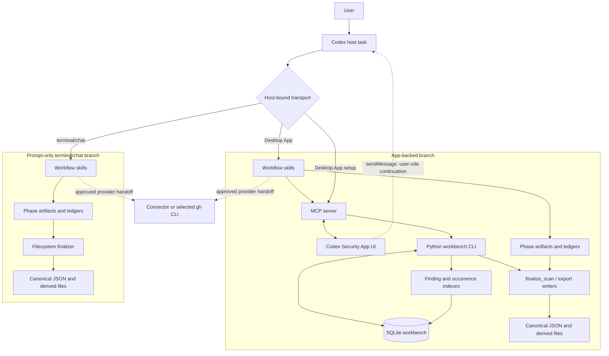
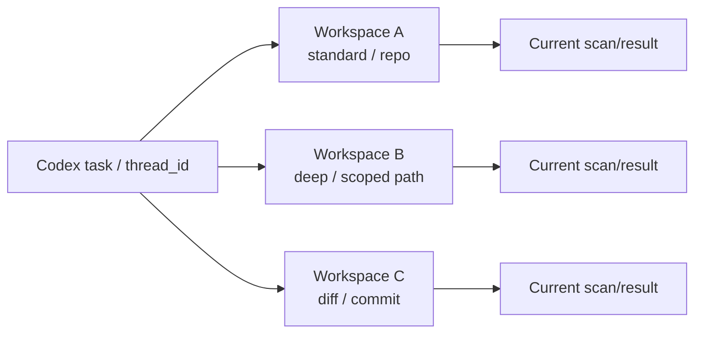
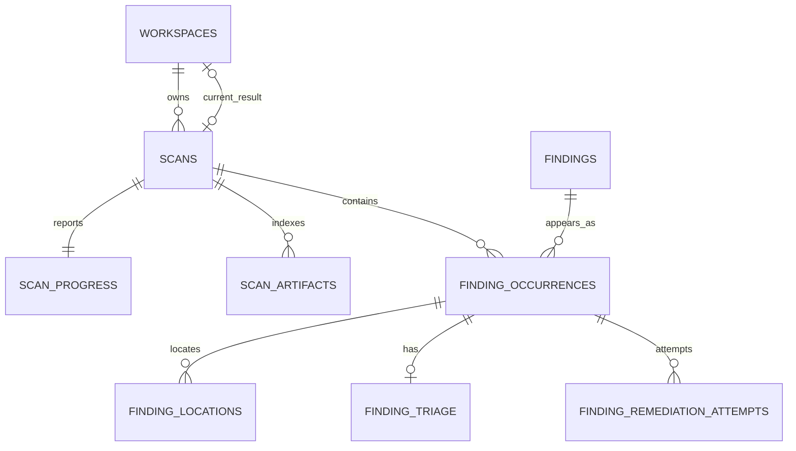
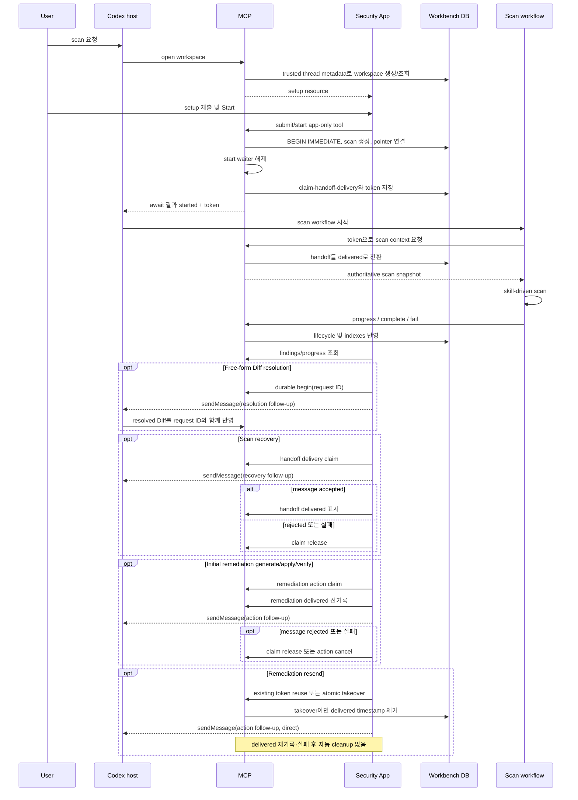
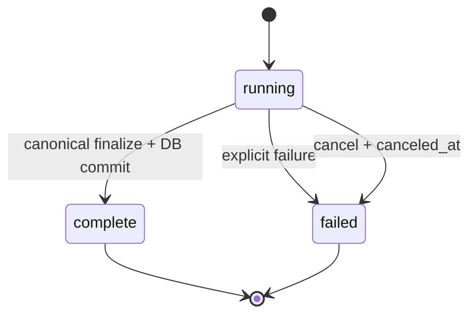
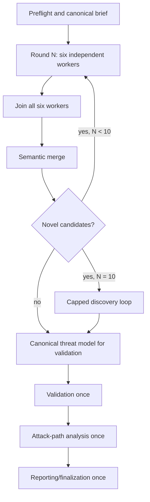

# Codex Security Plugin 0.1.11 아키텍처 분석

## 문서 지위

이 문서는 로컬에 설치된 OpenAI Codex Security Plugin `0.1.11`의 패키지, 스킬, Python workbench, MCP/App 동작과 공개된 제품 설명을 분석한 **버전 고정형 참고 자료**다. Kiro Security Power의 규범적 설계 문서가 아니며, Kiro 구현의 현재 계약은 `docs/architecture.md`와 Power의 실행 계약이 결정한다.

- 분석 대상: 로컬 Codex chat에서 실행되는 `codex-security@0.1.11`
- 분석 시점: 2026-07-23
- 분석 제외: Codex Security cloud의 서버 내부 구현
- 근거 우선순위: 설치 패키지의 실행 계약과 스키마 → 설치 패키지의 스킬 문서 → OpenAI 공개 문서
- 저작권 경계: 압축된 MCP/App 런타임은 동작과 인터페이스만 분석했으며, 복원한 원본을 이 저장소에 복사하지 않았다.

이 문서에서 “Codex workspace”는 Codex 채팅 자체가 아니라 workbench DB에 저장된 논리적 보안 작업공간을 뜻한다.

## 핵심 결론

Codex Security는 단일 스캐너 프로그램이 아니다. 다음 네 **책임 영역**이 권한을 분담하지만, 네 영역이 항상 실행되는 독립 프로세스 계층이라는 뜻은 아니다.

1. **Skill/model orchestration**이 위협 모델링, 후보 발견, 검증, 공격 경로 분석과 보고서 의미를 결정한다.
2. **MCP/App bridge**가 App-backed 경로에서 사용자 설정, 진행 표시, 결과 탐색과 Codex task handoff를 담당한다.
3. **Python/SQLite workbench**가 App-backed 경로의 workspace와 scan lifecycle, 정확한 대상 식별, 동시성, 인덱싱과 복구를 결정론적으로 관리한다.
4. **Canonical artifact 계약과 finalization/export 책임**이 두 실행 경로의 완료 결과를 검증·봉인하고 파생 결과를 만든다. App-backed 경로에서는 Python workbench가 finalizer와 export writer를 호출하고, terminal/chat 경로에서는 skill workflow가 filesystem finalizer를 직접 실행한다.

실행 topology는 host가 선택한 transport에 따라 갈라진다.

- **App-backed 경로:** Skill orchestration + MCP/App + Python/SQLite workbench + canonical artifacts
- **Prompt-only terminal/chat 경로:** Skill orchestration + filesystem artifacts/finalizer. App workspace, MCP handoff, SQLite scan lifecycle과 DB의 manifest digest pin은 사용하지 않는다.

가장 중요한 불변식은 다음과 같다.

- App-backed workspace 설정은 첫 scan이 연결되기 전까지만 바꿀 수 있다.
- `active_scan_id`는 “실행 중인 scan”이 아니라 해당 workspace의 현재 scan/result 포인터다.
- terminal transition 뒤에도 포인터를 유지한다.
- 같은 설정으로 terminal scan을 다시 실행할 수 있고, 새 scan이 포인터를 교체한다.
- Target, mode, scope, context, Diff target 등 저장된 setup 전체와 persisted capability-preflight cache는 첫 scan 뒤 고정되며, 이를 바꾸려면 새 workspace를 만든다.
- Scan row의 시작 계약 필드는 시작 시점 설정을 보존하는 불변 snapshot이다. 같은 row의 lifecycle, handoff와 seal 필드는 실행 중 변경된다.
- 진행률은 telemetry이며 workflow의 의미론적 authority가 아니다.
- 완료된 의미론적 결과의 authority는 검증·봉인된 canonical JSON이다.
- MCP handoff token은 결과 전달권을 claim할 뿐 scan mutation의 coordinator lease가 아니다.

## 1. 전체 구성



이 그림은 두 실행 경로와 책임의 배치를 나타낸다. 특히 finalizer/export는 App 경로의 별도 서비스가 아니라 Python workbench 안에서 호출되는 결정론적 코드 경계다. App은 MCP-backed view/controller에 그치지 않고, durable begin/claim 뒤 `sendMessage`로 user-role follow-up을 host task에 전달해 Diff resolution, scan recovery와 remediation worker를 시작하는 continuation producer이기도 하다.

### 1.1 설치 패키지

설치 루트는 다음 요소로 구성된다.

| 요소 | 책임 |
|---|---|
| `.codex-plugin/plugin.json` | plugin 이름, 버전, 공급자, 라이선스와 skill directory, connector app manifest, MCP server manifest 선언 |
| `.mcp.json` | Node MCP 서버의 stdio 실행과 timeout 설정 |
| `.app.json` | GitHub, Linear, Atlassian connector app 선언 |
| `mcp/server.mjs` | MCP tool과 Codex Security App UI resource를 등록하는 압축 런타임을 로드하는 부트스트랩 |
| `mcp/mcp-app.html.br` | setup, progress, findings, triage, remediation UI의 압축 배포 artifact |
| `skills/` | scan workflow와 phase별 semantic 계약 |
| `scripts/` | SQLite workbench, target inspection, preflight, finalization, projection |
| `preflight/` | scan profile별 capability requirement와 remediation patch registry |
| `schemas/` | manifest, findings, coverage JSON Schema |
| `references/` | 공통 artifact, reporting, security, static-assessment 계약 |

Plugin manifest 버전은 `0.1.11`이다. 패키지에 포함된 App/MCP UI resource에는 내부 컴포넌트 버전 `0.1.63`이 사용된다. 이는 관찰된 컴포넌트 버전 차이이며 plugin 계약 버전이 `0.1.63`이라는 뜻은 아니다.

여기서 `.codex-plugin/plugin.json`의 `apps`가 가리키는 `.app.json`은 외부 connector 선언이다. Setup과 findings를 표시하는 Codex Security App UI는 Node MCP runtime이 `mcp/mcp-app.html.br`를 MCP App resource로 별도 등록한다.

### 1.2 스킬 분해

스킬은 세 종류로 나뉜다.

| 구분 | 스킬 |
|---|---|
| 최상위 scan | `security-scan`, `security-diff-scan`, `deep-security-scan` |
| scan phase | `threat-model`, `finding-discovery`, `validation`, `attack-path-analysis` |
| 후속/독립 workflow | `fix-finding`, `triage-finding`, `track-findings`, `vulnerability-writeup`, `propose-security-hardening` |

최상위 scan skill은 순서, 범위, worker 사용과 종료 조건을 규정한다. Phase skill은 해당 단계의 입력, 증거 수준과 산출물만 규정한다. Python engine이 heuristic vulnerability discovery를 수행하는 구조가 아니다.

최상위 요청 라우팅도 skill 계약의 일부다.

| 사용자 의도 | Primary skill | 제외 조건 |
|---|---|---|
| 일반 repository 또는 scoped-path 보안 감사 | `security-scan` | Diff 또는 명시적 Deep 요청이 아님 |
| PR, commit, branch, working-tree 등 Git-backed change set 검토 | `security-diff-scan` | repository-wide 일반 감사가 아님 |
| 명시적인 deep, exhaustive, multi-pass, variance-reducing 감사 | `deep-security-scan` | Diff 대상이 아님 |

Phase skill은 이미 시작된 scan phase나 사용자가 명시적으로 그 분석만 요청한 경우에 사용한다. Full scan 요청을 phase skill 하나로 대신 라우팅하지 않는다.

## 2. Authority 모델

Codex Security는 하나의 객체가 모든 진실을 소유하지 않는다. 다음 표의 `App` 항목은 App-backed 경로에만 존재하고, `공통` 항목은 App과 terminal/chat 경로가 공유한다.

| 관심사 | Authority | 경로 | 비고 |
|---|---|---|---|
| 사용자의 scan 의도와 top-level routing | 사용자 입력 + host context + top-level skill 계약 | 공통 | transport와 Standard/Diff/Deep을 결정 |
| 저장된 setup | workspace row | App | 첫 scan 전까지만 변경 가능 |
| 시작 당시 App 계약 | scan row의 target/mode/scope/context/Diff identity 필드 | App | workspace 설정을 복사한 불변 snapshot; 같은 row의 lifecycle/handoff/seal state는 mutable |
| workflow 단계 의미 | active skill 계약 + phase artifacts/ledgers | 공통 | progress row가 대신하지 않음 |
| 실행 진행 표시 | `scan_progress` | App | monotonic telemetry |
| 완료된 보안 결과 | canonical JSON + filesystem seal | 공통 | DB finding row나 Markdown보다 우선 |
| manifest 외부 pin | scan row의 `seal_manifest_digest` | App | terminal/chat 경로에는 이 DB pin이 없음 |
| 제품 조회/필터 | DB finding/occurrence indexes | App | canonical 결과의 index/projection |
| local finding triage | `finding_triage` row | App | canonical finding과 분리된 mutable open/closed state이며 CSV에 반영될 수 있음 |
| remediation attempt/action lifecycle | `finding_remediation_attempts` + CAS/action claim state | App | canonical remediation 제안과 분리된 mutable generate/apply/verify state |
| 사람이 읽는 결과 | `report.md`, finding writeups, hardening | 공통 | canonical 결과에서 파생되며 일부는 seal 밖 |
| task 전달 상태 | handoff claim/delivery state | App | scan 실행 권한과 별개 |
| 외부 이슈 상태 | 해당 provider의 readback | 공통 | scan 결과와 분리된 mutable state |

따라서 SQLite workspace/scan row는 App-backed lifecycle의 authority이지 terminal/chat scan 전체의 보편 authority가 아니다. 반대로 semantic phase와 canonical artifact 계약은 두 경로에 공통이다.

따라서 다음 해석은 잘못이다.

- App cache가 workspace authority라는 해석
- `active_scan_id`가 non-terminal scan만 가리킨다는 해석
- progress phase가 artifact 완료를 증명한다는 해석
- `report.md`를 structured result보다 우선하는 해석
- handoff token이 scan update/complete 권한을 독점한다는 해석

## 3. Codex workspace의 의미

이 절의 workspace와 scan row 의미는 App-backed workbench 경로에 적용된다. Prompt-only terminal/chat scan은 이 DB identity를 만들지 않는다.

### 3.1 채팅과 workspace는 동일하지 않다

Codex workspace는 workbench DB의 opaque UUID row다. `thread_id`가 host Codex task와 연결하지만 양자는 동일한 identity가 아니다. Setup equality를 workspace identity로 사용하거나 같은 설정의 workspace를 자동 deduplicate하지 않는다.

- 한 Codex task에 여러 security workspace가 존재할 수 있다.
- task에서 workspace를 다시 열 때는 해당 task의 최신 workspace를 선택할 수 있다.
- MCP의 `sessionId`는 이 workspace UUID다.
- 다른 setup으로 scan하려면 같은 task 안에서도 새 workspace를 만들 수 있다.
- 같은 task와 같은 setup이어도 새 workspace를 명시적으로 열면 별도 UUID가 만들어질 수 있다.

Progress workspace의 자동 재개는 단순 생성 시각 최신순이 아니다. 같은 thread에서 running scan이 연결된 workspace를 우선하고, 그 안에서 progress activity를 비교한다. Terminal workspace끼리는 workspace, triage, remediation activity를 포함해 선택한다. `sessionId`를 지정한 경우에는 그 workspace를 직접 연다.

Workspace 선택은 thread-aware지만 workbench가 반환하는 모든 target metadata가 thread-scoped인 것은 아니다.

- Scan이 아직 연결되지 않은 workspace projection의 `recentTargets`는 DB의 모든 workspace에서 최근 submitted target path를 모아 최대 5개를 반환한다. `thread_id` 조건이 없다.
- Scan context의 `otherRunningDeepScans`는 현재 scan을 제외한 DB 전체의 running Deep scan을 workspace와 thread에 관계없이 반환한다. Raw context에는 scan ID, target path, phase, started/updated timestamp가 포함된다.

따라서 같은 workbench DB를 공유하는 task끼리는 이 두 projection을 통해 target metadata를 볼 수 있으며, workspace ownership이 이 필드까지 격리한다고 해석하면 안 된다.



### 3.2 설정 변경과 재실행

Workspace 설정은 `active_scan_id IS NULL`일 때만 저장할 수 있다. 첫 scan이 시작되면 설정은 terminal 여부와 무관하게 고정된다.

| 상태 | 같은 설정 재실행 | 설정 변경 |
|---|---:|---:|
| scan 시작 전 | 해당 없음 | 가능 |
| scan running | 불가 | 불가 |
| scan complete/failed/canceled | 가능 | 불가 |

Terminal scan 뒤 같은 workspace에서 재실행하면 새 scan row를 만들고 `active_scan_id`가 새 scan을 가리킨다. `active_scan_id`를 terminal transition에서 `NULL`로 비우지 않는다.

### 3.3 `active_scan_id`의 정확한 의미

이 필드명은 오해하기 쉽지만 실제 의미는 다음과 같다.

> 해당 workspace에 연결된 현재 scan/result의 포인터

실행 중인지 여부는 연결된 scan row의 status로 판단한다. Workspace에는 `REFERENCES scans(id) ON DELETE SET NULL` FK가 있으며, 참조 scan이 삭제되는 경우를 DB 차원에서 방어한다. 관찰된 0.1.11 workbench에는 일반 사용자가 scan을 삭제하는 cleanup API는 없다.

## 4. Workbench 저장 구조

### 4.1 DB 위치와 연결 설정

기본 DB는 다음 순서로 결정된다.

1. `CODEX_SECURITY_STATE_DIR`가 있으면 그 아래의 workbench DB
2. 아니면 `$CODEX_HOME/state/plugins/codex-security/workbench.sqlite3`

Workbench는 WAL, foreign keys, 5초 busy timeout, 제한된 재시도를 사용하며 DB 파일 권한을 `0600`으로 제한한다.

### 4.2 schema migration

0.1.11 패키지의 workbench는 10단계 migration을 포함한다.

| 버전 | 주요 변경 |
|---:|---|
| 1 | workspace, scan, progress, artifact, finding 기본 구조 |
| 2 | capability preflight 저장 |
| 3 | finding triage, remediation, 상세 정보 |
| 4 | scan handoff claim |
| 5 | remediation claim |
| 6 | thread-scoped workspace |
| 7 | remediation delivery timestamp |
| 8 | manifest seal digest |
| 9 | target filesystem identity |
| 10 | cancellation timestamp |

현재 1–10 migration을 적용하기 전에 모든 DB connection은 pre-release migration history를 정규화한다. 이 compatibility path는 과거 2–5 번호 체계를 인식하고, 일관되지 않은 history는 거부하며, 필요한 column을 복원한 뒤 record를 현재 번호로 다시 맞춘다. 따라서 parity migration은 fresh schema만이 아니라 이 기존 pre-release state의 안전한 승계도 고려해야 한다.

핵심 table은 다음과 같다.



`workspaces`, `scans`, `scan_progress`, `scan_artifacts`, `findings`, `finding_occurrences`, `finding_locations`, `finding_triage`, `finding_remediation_attempts`와 `schema_migrations`가 저장된다. Partial unique index가 workspace당 running scan을 하나로 제한한다.

### 4.3 provisional setup과 submitted setup

Workspace 생성은 UI가 잘못되거나 미완성인 입력을 보여주고 고칠 수 있도록 provisional setup을 저장할 수 있다. 생성 시 validation 오류를 보존하지만, scan 시작 전 제출은 엄격하게 검증한다.

- `workspace_state`: active scan이 없으면 현재 setup을 동적으로 검사해 UI 상태를 만든다.
- `save_workspace`: 전체 setup을 검증하고 submitted 상태로 만든다.
- `start_scan`: submitted setup을 다시 검증하고 scan row의 immutable start-contract 필드로 복사한다.

자유 입력 Diff spec은 비동기 해석 중 오래된 응답이 새 입력을 덮지 않도록 request UUID인 `diff_resolution_id`로 begin/cancel/set을 직렬화한다.

## 5. Target 모델

### 5.1 공통 제약

- target은 존재하는 절대 local directory여야 한다.
- bare Git repository는 거부한다.
- scope 입력은 target 내부의 기존 directory를 가리키는 contained absolute path 또는 POSIX-style relative path다. DB에는 target-relative POSIX path로 정규화된다.
- Git 명령 인자는 shell string이 아니라 argument array로 전달한다.
- Canonical path와 filesystem identity는 start transaction의 target-replacement race와 remediation checkout identity를 검사하는 데 사용한다. Completion의 live target drift 검사는 Standard/Deep snapshot scan과 working-tree Diff에만 적용되며 target 존재 여부, 해당 revision 조건과 content digest를 확인한다. Stored device/inode는 completion에서 다시 비교하지 않는다.

### 5.2 scan 종류별 대상

| Scan | 허용 target | scope | identity/drift 기준 |
|---|---|---|---|
| Standard | Git repository, 하위 폴더, non-Git directory | 전체 또는 scoped | revision + snapshot/content digest |
| Deep | repository 또는 scoped directory | DB 계약상 `.` | Standard와 같은 snapshot 계열 |
| Diff: working tree | checked-out Git root | `.` | HEAD + deterministic working-tree digest |
| Diff: commit | locally available commit | `.` | exact commit + first parent 또는 empty-tree base + reviewed-content `snapshotDigest` |
| Diff: range | distinct locally available base/head | `.` | exact base/head object identity + reviewed-content `snapshotDigest` |

Deep의 scoped scan은 상위 repository에 별도 scope를 저장하는 대신 scoped directory 자체를 `targetPath`로 사용하고 scope를 `.`로 표현한다.

Canonical `git_diff` target은 working-tree, commit, range 구분 없이 모두 deterministic reviewed-content `snapshotDigest`를 요구한다. Working-tree Diff는 DB가 이 값을 시작 시 저장한 `diff_content_digest`와 completion 때 결합한다. Commit/range Diff도 finalizer가 `snapshotDigest`를 요구하고 seal하지만, workbench completion은 그 digest를 재계산하거나 DB 값에 결합하지 않고 manifest의 base/head만 scan row의 exact identity와 비교한다.

Commit/range scan은 시작 시 대상 object가 local repository에 존재하면 현재 checked-out HEAD와 달라도 되고 clean worktree도 요구하지 않는다. 세 Diff target 중에는 working-tree Diff만 현재 checkout content drift를 추적한다. Commit/range Diff completion은 checkout 존재, 현재 HEAD/content digest 또는 Git object를 다시 해석하지 않는다. 별도로 Standard/Deep Git scan은 시작 당시 HEAD와 worktree snapshot digest를 completion 전후에 재검증한다.

Canonical result 계약은 sanitized remote identity를 표현할 수 있지만, 로컬 workbench의 안정 target ID는 canonical local path의 SHA-256을 기반으로 한다.

## 6. Setup에서 Agent 실행까지

### 6.1 App-backed 흐름



`open_codex_security_workspace`는 caller가 보낸 임의 thread field가 아니라 trusted MCP request metadata에서 host thread ID를 얻는다. UI가 Start를 누르면 최대 14분 대기 중인 `await_codex_security_scan_start`가 해제된다.

App의 host message 경로는 fire-and-forget UI 편의 기능이 아니다. 다만 세 continuation은 하나의 공통 순서를 사용하지 않는다.

- **Free-form Diff:** `begin_codex_security_diff_resolution`으로 request ID를 durable하게 만든 뒤 host에 resolution 요청을 보내고, host가 그 request ID와 함께 resolved Diff를 반영한다. 이 경로에는 별도 delivered state가 없다. Message 전달이 실패하면 pending resolution을 cancel한다.
- **Scan recovery:** handoff delivery를 claim한 뒤 host에 recovery message를 보내고, message가 수락되면 delivered로 표시한다. 거부되거나 전달에 실패하면 claim을 release한다.
- **최초 remediation generate/apply/verify:** action request와 claim을 만든 뒤 `pending_action_delivered_at`을 먼저 기록하고, awaited host message를 보낸다. Message가 취소·거부되거나 전달에 실패하면 action을 cancel하거나 claim을 release하며, release는 claim과 선기록된 delivered timestamp를 함께 제거한다.
- **Remediation resend:** 현재 action token이 있으면 그대로 재사용하고, 없으면 DB에서 atomic takeover를 시도한다. Takeover는 미전달 claim의 120초 lease 또는 전달된 worker의 900초 lease가 만료된 경우에만 가능하며 `pending_action_delivered_at`을 `NULL`로 되돌린다. 그 다음 App은 host message를 직접 fire-and-forget으로 보내고 `mark_codex_security_finding_remediation_delivered`를 다시 호출하지 않는다. Resend의 message 결과를 await하지도, 실패 뒤 claim release/action cancel을 자동 실행하지도 않는다.

따라서 parity 구현은 App↔MCP RPC와 host `sendMessage` bridge뿐 아니라 각 continuation의 서로 다른 durable ordering을 그대로 보존해야 한다.

### 6.2 scan start transaction

Start는 다음 순서로 진행된다.

1. submitted setup과 target을 검증한다.
2. 기존 running scan 유무를 검사한다.
3. Exact target snapshot과 filesystem metadata를 계산하고, 선택한 target 밖의 target별 artifact root를 준비한다.
4. `BEGIN IMMEDIATE`를 획득한다.
5. running scan, workspace version/updated timestamp, device/inode를 다시 확인한다.
6. Transaction 안에서 unique scan directory를 생성한다.
7. 그 경로를 가진 UUID scan row와 progress row를 만들고 workspace pointer를 연결한 뒤 commit한다.

Target별 artifact root는 `BEGIN IMMEDIATE` 전에, unique scan directory는 transaction을 획득한 뒤 생성한다. 두 filesystem side effect 모두 SQLite rollback 대상이 아니므로 이후 DB 작업이 실패해도 생성된 directory가 자동으로 제거되지는 않는다.

App server는 `CODEX_SECURITY_SCAN_ROOT`가 없으면 프로세스 수명 동안 유지되는 임시 `codex-security-scans-*` root를 만든다. Workbench는 그 아래에 target 이름, revision/시간, random component를 조합한다.

DB start는 model worker를 생성하지 않는다. 실제 workflow는 handoff를 받은 Codex host가 skill을 실행하면서 시작한다.

### 6.3 handoff의 의미

Start waiter는 scan의 handoff delivery를 claim하고 UUID token을 받는다. `get_codex_security_scan_context(scanId, token)`이 delivery claim을 delivered로 전환하고 authoritative scan snapshot을 반환한다.

- 결과: `started`, `already_delivered`, `timed_out`
- stale scan handoff claim: 120초 뒤 회수 가능
- explicit recovery: recovery token prefix를 통해 cross-thread 복구 가능
- token의 범위: context delivery 및 continuation claim
- token이 하지 않는 일: progress/update/complete/fail mutation의 bearer authorization

즉 0.1.11에는 “한 coordinator만 scan row를 갱신할 수 있다”는 별도 coordinator lease가 없다. Mutation은 기본적으로 `scanId`를 기준으로 한다.

## 7. Scan lifecycle과 progress

### 7.1 상태

DB status는 `running`, `complete`, `failed`다. 취소는 별도 `canceled_at`을 가진 failed scan이며 UI가 이를 `canceled`로 projection한다.



Running 상태는 Codex turn이나 MCP process 종료와 함께 자동 소멸하지 않는다. Durable DB state와 scan artifacts를 이용해 복구한다.

### 7.2 phase와 progress

Phase 순서는 고정되고 역행할 수 없다.

```text
preflight → threat_model → discovery → validation → attack_path → reporting
```

한 pass 안에서는 total과 completed가 monotonic이다. Deep scan이 다음 pass로 넘어갈 때 pass 번호가 증가하고 completed는 새 pass의 0에서 시작할 수 있다.

App-backed workflow는 phase와 discovery work를 다음 publication 순서로 갱신한다.

- 각 phase에 진입할 때 `update_codex_security_scan_progress`를 즉시 호출한다.
- `reviewItemsTotal`은 deterministic worklist 또는 worker assignment가 확정된 뒤에만 공개한다.
- Discovery item은 해당 review와 coverage receipt가 모두 완료된 뒤에만 completed로 계산한다.
- Discovery phase를 벗어나기 전에는 published completed가 total과 같아야 한다.
- Deep은 매 round 시작에 `deepReviewPass`를 새 round로 갱신하고 그 pass의 progress를 reset/update한다. 같은 pass 안의 monotonicity와 pass 전환 시 reset을 구분해야 한다.

Progress는 UI telemetry다. Phase artifact, ledger, canonical result가 존재하지 않는데 progress만 완료됐다고 기록되어도 semantic completion으로 인정되지 않는다.

## 8. Capability preflight

Registry에는 `security_scan`, `security_diff_scan`, `deep_security_scan` profile이 있다. 검사 항목에는 delegated workers, goal 지원, worker slot 수, Deep phase skill, orchestration depth/config가 포함된다.

| Profile | Block | Warn | Suggest |
|---|---|---|---|
| Standard | 없음 | delegation 부재, usable worker slot 6개 미만 | goal tool 또는 goals 부재 |
| Diff | 없음 | delegation 부재 | goal tool 또는 goals 부재 |
| Deep | phase skill 부재, delegation 부재, usable worker slot 6개 미만, V1 depth 2 미만 | usable worker slot 8개 미만 | goal tool 또는 goals 부재 |

Multi-agent V1, V2, bridge-V2를 인식하며 config는 system, user, optional CLI profile, trusted project 순으로 해석한다. Project `.codex/config.toml`은 해당 project가 trusted일 때만 적용한다.

이 설정 해석은 **plugin 0.1.11에 패키징된 compatibility helper의 계약**이다. 분석 시점의 Codex host 문서는 multi-agent를 `[agents]`의 `agents.enabled`와 `agents.max_concurrent_threads_per_session`으로 설명하고 primary thread를 concurrency cap에서 제외한다. 반면 0.1.11 registry의 V2 remediation은 `features.multi_agent_v2.enabled`와 `features.multi_agent_v2.max_concurrent_threads_per_session = 9`를 제안하고 cap에 root thread가 포함된 것으로 계산한다. 따라서 preflight 설정명과 cap 계산을 현재 host의 보편 모델로 일반화하면 안 된다. 이 계약을 이식하는 구현은 0.1.11의 versioned adapter를 복제할지, 현재 host capability를 별도 adapter로 정규화할지 명시해야 한다.

- blocking failure가 있으면 `blocked`
- 판정할 수 없는 필수 capability가 있으면 `incomplete`
- 나머지는 `ready`

App setup이 먼저 끝난 뒤 scan context를 받은 Agent가 authoritative preflight를 수행한다. Preflight를 시작할 때 tool surface를 한 번 조사하고 runtime ownership, version, capacity 같은 사실을 첫 helper 호출에 함께 전달한다. CLI에서는 helper를 직접 실행하고, delegation을 지원하는 다른 host에서는 전담 worker가 helper를 실행하도록 한다. Worker spawn이 실패하거나 concrete worker ID를 반환하지 않으면 parent가 helper를 직접 실행하고 spawn failure를 보고한다.

필수 capability의 runtime version, ownership 또는 capacity를 확인할 수 없으면 성공으로 추정하지 않고 `incomplete`로 둔다. Interactive mode에서는 config 변경 전에 승인을 받는다. Non-interactive/headless mode는 helper가 제시한 ordinary `value`/`remove` operation만 active writable user config에 한 번 적용하고 preflight를 한 번 다시 실행한다. `kind = "host_setting"` remediation은 설정 안내만 제공하며 자동 적용하지 않는다.

Non-ready recovery는 transport에 따라 다르다.

- **App-backed:** 이미 생성된 durable scan을 `running`으로 보존하고 사용자의 선택, 새 session 또는 later handoff에서 retry한다. 문서화된 복구를 소진했거나 사용자가 취소한 경우에만 fail한다.
- **Prompt-only terminal/chat:** 보존할 DB scan row가 없다. 재검사도 non-ready이면 exact blocker를 보고하고 실행을 끝내며 “scan이 running/paused 상태로 남았다”고 주장하지 않는다.

따라서 “blocked/incomplete이면 running scan을 보존한다”는 규칙은 App-generated durable scan에만 적용된다.

Workspace의 `capability_preflight_json`은 이전 호환과 UI cache 성격이다. App-backed scan의 실행 authority가 아니다.

### 8.1 Goal과 completion ownership

Goal은 긴 scan의 완료 조건과 재개 지점을 보존하는 optional persistence aid이며 scan authority가 아니다. App 경로에서는 Start와 authoritative scan context 수령이 끝나고 preflight가 `ready`가 된 뒤에만 goal을 create/adopt한다. Goal 도구가 없으면 같은 artifact-closure objective를 사용자에게 보이는 progress update에 유지한다.

Deep은 coordinator goal과 worker-local discovery goal의 완료 경계를 분리한다. Worker goal의 완료는 해당 worker artifact와 receipt가 저장됐다는 뜻이고, 전체 Deep goal의 완료는 모든 round와 centralized tail, reporting이 닫혔다는 뜻이다. 모든 top-level scan goal은 filesystem/App finalization이 성공하고 generated `report.md`가 실제로 존재한 뒤에만 complete할 수 있다.

`vulnerability-writeup`과 `propose-security-hardening`은 scan 없이도 실행할 수 있는 독립 workflow다. Scan reporting에서는 한 worker에 vulnerability 하나만 배정한다. 각 reportable finding의 최초 draft를 전담 worker가 만들고, worker가 stall하거나 draft가 quality rule을 충족하지 못하면 같은 finding을 다른 전담 worker로 재시도한다. 모든 accepted writeup이 준비된 뒤 전체 collection에 대해 hardening을 한 번 수행한다.

## 9. Standard scan

Standard scan의 상위 흐름은 다음과 같다.

1. setup과 exact target을 고정한다.
2. capability preflight를 수행한다.
3. goal과 scan contract를 만든다.
4. 적용되는 root/nested `SECURITY.md`를 컴파일한다.
5. authoritative threat model을 해석하거나 repository-level threat model을 만든다.
6. review surface를 inventory하고 rank/worklist를 만든다.
7. candidate finding을 발견한다.
8. candidate를 검증한다.
9. valid finding의 attack path와 reportability/severity를 판정한다.
10. canonical JSON을 완성한다.
11. reportable finding마다 전담 worker가 상세 writeup을 만들고, stall/quality rule이 요구하면 같은 finding을 다른 전담 worker로 재시도한다.
12. 전체 finding set에 대해 hardening portfolio를 한 번 만든다.
13. finalizer를 실행한다. App 경로는 DB를 `complete`로 전환하고, terminal/chat 경로는 filesystem completion으로 끝난다.

Repository/scoped inventory는 source-like surface의 누락 여부를 추적한다. Ranking worker는 최대 6개를 사용하고, file-review ownership과 candidate ledger를 통해 중복과 누락을 조정한다.

Deterministic inventory에서 ranked/deep-review worklist와 coverage ledger를 만들고, 모든 in-scope row를 completion receipt 또는 `deferred`, `not_applicable`, `suppressed`, `reportable` 같은 명시적 disposition으로 닫는다. Discovery candidate와 아직 closure가 필요한 seeded/root-control ledger row도 validation과 attack-path receipt 또는 정확한 deferred reason을 가져야 한다. Delegated worker가 없으면 명시된 degraded path로 진행할 수 있지만 exhaustive coverage를 주장해서는 안 된다.

### 9.1 High-impact coverage frontier

Standard repository/scoped scan은 일반적인 file inventory에 더해 **high-impact boundary × serious vulnerability family** coverage ledger를 deep validation 전에 먼저 만든다.

- Command/code injection과 RCE, SQL/NoSQL/LDAP/XPath/template injection, SSTI, unsafe deserialization, SSRF/callback abuse, path traversal 및 arbitrary file read/write, unsafe upload, credential/callback impact가 있는 header injection/open redirect, meaningful privilege/data boundary를 넘는 authz·tenant·object isolation bypass를 우선 family로 다룬다.
- Ledger는 candidate 목록이 아니다. Candidate가 없는 조합도 row가 필요하며 boundary, shard/area, files checked, source 또는 privileged boundary, sink/control, disposition, evidence와 proof gap을 기록한다.
- Dominant runtime/product area는 concrete shard로 나타내거나 repository evidence를 근거로 명시적으로 제외해야 한다. Candidate row만 있거나 global sink count만 있는 ledger, `no top candidate surfaced`라는 결론, `server`나 `core` 같은 분해되지 않은 blob row는 frontier closure가 아니다.
- Large repository는 service, router group, package/protocol namespace, parser/job/deployment/privileged-tool surface와 vulnerability family를 교차해 shard를 만든다. 모든 applicable high-impact shard에 한 번의 reachability/frontier pass를 완료하기 전에 한 shard의 장시간 build/debug/validation에 머물지 않는다.
- High-impact pattern 하나가 발견되면 같은 control을 공유하거나 독립적으로 reachable한 sibling file, route, handler, model, config, wrapper와 concrete implementation을 먼저 확장한다. 이 sibling/root-control row를 각각 닫거나 정확히 defer하기 전에는 더 극적인 이웃 finding으로 대체하지 않는다.
- Data exposure, hardcoded secret, weak session/cookie/security config, CSRF, rate limit과 plaintext storage는 high-impact ledger와 file list를 소진한 뒤의 secondary review다. 단, code execution, injection, privilege escalation, meaningful auth bypass 또는 sensitive cross-boundary impact를 직접 가능하게 하면 high-impact queue에서 다룬다.

각 applicable·seeded row는 exact evidence로 `reportable`, `suppressed`, `not_applicable`, `deferred` 중 하나가 될 때까지 열린 상태다. Broad sink search는 seed 생성일 뿐 boundary, closest control, sink/broken control과 plausible impact가 연결되기 전에는 coverage가 아니다.

### 9.2 Standard/Diff delegated work 계약

Standard와 Diff도 Deep과 별개인 엄격한 worker isolation과 dispatch 계약을 가진다.

- Native V2 worker는 self-contained prompt와 `fork_turns=none`으로 시작한다. Skill, parent history 또는 reference 이름을 암묵적으로 상속한다고 가정하지 않고 현재 scan의 정확한 지시, target, mode, artifact path와 할당 row를 prompt에 넣는다.
- Ranking JSONL은 사전에 고정한 immutable pool plan을 사용한다. Planned slot마다 worker를 한 번만 spawn하고 ordered multi-shard assignment와 plan digest/exact receipt를 사용하며 refill이나 follow-up assignment를 하지 않는다.
- Ranking 외 JSONL work는 usable slot 수로 bounded dispatch하고, 특정 worker 결과를 검증한 뒤 비는 slot을 refill한다.
- File-review worker 하나는 `deep_review_input.jsonl` row 하나 또는 강하게 결합된 최대 5개 file의 작은 shard만 소유한다. 할당 file을 전부 읽고 full-file receipt를 남긴다.
- Worker는 target code에 대해 read-only다. 다만 지정된 scan artifact, work ledger, raw candidate와 candidate receipt는 기록할 수 있다.
- Plausible candidate를 찾은 file-review worker는 source/control/sink/impact뿐 아니라 candidate-local validation과 attack-path 사실 또는 정확한 proof gap까지 반환한 뒤 cross-file dedupe에 넘긴다.
- Parent는 worklist 생성, bounded dispatch, receipt validation, ledger reconciliation, aggregation, cross-file dedupe와 final closure를 소유한다.

Threat model은 기본적으로 repository-level context를 만든다. 다만 충분히 구체적인 `AGENTS.md`, resolved security guidance 또는 사용자가 제공한 threat model body가 있으면 그것이 authoritative input이 될 수 있다. 제공된 authoritative body는 요약본으로 대체하거나 모델 판단으로 고쳐 쓰지 않고 유일한 source of truth로 유지한다. Cache된 threat model은 마지막의 `Repository`와 `Version` identity가 현재 대상과 일치할 때만 재사용한다.

이후 단계는 requested repository/scoped path에 finding과 coverage를 고정하지만, 구체적 finding의 동작을 이해하는 데 직접 필요한 supporting file은 열 수 있다. 이를 unrelated repository-wide enumeration으로 확장해서는 안 된다.

## 10. Diff scan

Diff scan은 Standard와 같은 phase를 사용하지만 exact Git change set만 검토한다.

- deterministic changed-source inventory를 만든다.
- changed, deleted, renamed source를 모두 포함한다.
- 변경을 이해하는 데 직접 필요한 supporting context만 연다.
- Changed pattern이나 modified shared dependency가 새로 도달하거나 영향을 주는 sibling instance는 Diff scope에 포함하고 각 instance의 source, closest control, sink, impact와 suppression evidence를 독립적으로 보존한다.
- Diff가 새로 취약하게 만들거나 shared control/sink를 변경하지 않은 unchanged sibling은 negative/control evidence로만 사용한다. Diff-linked pattern family가 소진되면 repository-wide enumeration으로 확장하지 않는다.
- 일반 repository audit로 scope를 넓히지 않는다.

`rank_input`과 `deep_review_input`이 변경 범위를 고정한다. Working-tree Diff는 시작 시 계산한 HEAD/content digest를 completion 전후의 live target과 대조한다. Commit/range Diff는 시작 시 exact base/head를 고정하고 completion에서는 manifest binding만 그 persisted identity와 대조한다.

모든 changed source-like row를 deep-review하고 completion receipt를 남긴다. 모든 discovery candidate는 discovery, validation, attack-path closure를 갖거나 정확한 deferred reason을 기록한다. Delegated worker가 없는 degraded path에서는 exhaustive coverage를 주장하지 않는다.

## 11. Deep scan

Deep scan은 diff용이 아니라 동일 scope에서 발견 분산을 줄이고 recall을 높이는 반복 wrapper다.

### 11.1 round 구조

- round마다 독립 discovery worker 6개를 사용한다.
- 최대 10 round까지 실행한다.
- 모든 worker는 같은 canonical brief와 authoritative worklist를 받는다.
- themed lane으로 문제 종류를 미리 분할하지 않는다.
- worker는 이전 round의 semantic 결과를 보지 않고 독립 위협 모델을 만든다.
- native V2 worker는 `fork_turns=none`으로 시작해 coordinator 대화 history를 상속하지 않는다.
- worker에는 host의 default agent type, model, reasoning을 사용하며 coordinator가 worker별로 임의 변형하지 않는다.
- worker별 artifact 공간을 사용한다.
- coordinator는 round 중 orchestration만 수행한다.
- 6개 worker가 모두 종료되고 idle이 된 뒤 결과를 읽고 merge한다.

V1에서 orchestration depth 2가 blocking requirement인 이유는 discovery worker가 exhaustive file review를 위해 다시 nested delegation을 사용할 수 있어야 하기 때문이다. 단순히 coordinator가 worker 여섯 개를 시작할 수 있다는 사실만으로 Deep capability가 충족되지는 않는다.



Merge는 단순 문자열 일치가 아니라 remediation-subsumption을 사용한다. 같은 root cause와 remediation으로 함께 제거되는 후보는 병합하지만, 독립적으로 고쳐야 하는 instance는 보존한다.

첫 complete zero-novelty round에서 discovery를 종료한다. 첫 round에서 후보가 전혀 없으면 no-findings 경로로 간다. 10번째 round에도 새 후보가 있으면 discovery loop의 내부 terminal state를 `capped`로 기록하고 현재 canonical inventory로 중앙 validation tail을 진행한다. Coverage의 `complete`, `partial`, `unknown`은 round cap이 아니라 실제 deferred scope와 입증 가능한 coverage에 따라 별도로 결정한다.

최종 사용자 결과는 worker, round, novelty 같은 내부 orchestration 세부를 노출하지 않는다.

### 11.2 worker 실패와 round 복구

Deep discovery의 불완전한 round와 partial artifact는 resumable condition이다.

- Worker가 실패하면 가능한 partial artifact를 보존하고 그 worker만 retry 또는 replace해 round마다 6개의 usable completed pass를 확보한다.
- 6개가 닫히기 전에는 partial output을 merge하거나 novelty를 계산하지 않고, worker spawn 실패·crash·missing artifact를 candidate space 소진으로 해석하지 않는다.
- Missing/inconsistent artifact와 round bookkeeping mismatch는 repairable workflow defect다. 현재 turn에서 고치지 못하면 artifact와 App의 durable running scan을 보존해 handoff한다.
- 첫 discovery spawn batch가 어떤 worker도 시작하기 전에 sender-thread lookup error로 실패하면 clean pre-round state에서 같은 canonical brief로 전체 round를 한 번 다시 시작하며 실패한 시도를 round progress에 넣지 않는다.
- Later round가 worker-thread capacity 부족으로 spawn하지 못하면 running worker의 종료와 artifact 수집을 기다린 뒤 spawn을 한 번 다시 시도한다. 그래도 6개를 만들지 못하면 상태를 보존하고 정상 discovery loop를 완료하지 못했다고 보고하며 round 크기를 줄이거나 novelty collapse를 주장하지 않는다.

Discovery loop가 `saturated` 또는 `capped` terminal state에 도달하기 전에는 validation, attack-path analysis와 canonical finalization에 진입하지 않는다. Round, turn, context window 또는 goal run이 끝났다는 이유만으로 resumable App scan을 terminal failure로 바꾸지 않는다.

### 11.3 concurrent Deep 경고

새 Deep scan row가 생성되고 authoritative scan context가 처음 로드된 직후, Deep workflow skill이 preflight보다 먼저 DB-global `otherRunningDeepScans`를 확인해 사용자에게 Continue/Cancel을 묻는다. Warning은 다른 scan마다 target path, plain-language phase와 사람이 읽을 수 있는 start time만 보여주고 raw context의 scan ID, raw timestamp, updated time은 노출하지 않는다. Cancel하면 새 scan만 failed로 전환하고 기존 Deep scan에는 손대지 않는다. 이는 전체 scan을 막는 전역 lock이 아니라 고비용 동시 실행을 알리는 workflow guard다.

## 12. Phase별 semantic 계약

| Phase/Skill | 책임 | 대표 산출물 |
|---|---|---|
| Threat model | 자산, entry point, trust boundary, attacker capability, security invariant 정의 | repository threat model |
| Finding discovery | source-to-sink proof chain과 plausible candidate 발견 | candidate ledgers |
| Validation | 동적/정적 검증, strongest counterevidence, 결론 | validation records |
| Attack path | reachability, exploit chain, impact, severity, reportability | attack-path records |
| Vulnerability writeup | reportable finding 하나를 source-backed 보고서로 파생 | `findings/<slug>/...` |
| Hardening | 전체 finding set의 구조적 개선안을 비교 | `hardening/...` |

Phase skill은 필요해질 때만 읽는 strict progressive contract다. 각 phase에서 다음 순서를 지킨다.

1. 현재 phase의 skill을 읽는다.
2. 현재 phase에 필요한 입력만 로드한다.
3. 해당 workflow와 checklist를 완전히 닫는다.
4. 그 후에만 다음 phase skill을 읽는다.

현재 phase가 끝나기 전에 later-phase skill을 읽거나 여러 phase의 effort를 한 번에 amortize하면 안 된다. Progress phase를 앞으로 이동시키지 않았더라도 이 no-read-ahead 규칙을 어기면 semantic workflow parity가 아니다.

### 12.1 Validation과 final policy 알고리즘

Validation은 단순한 `valid` label이 아니라 candidate별 증거 기록이다.

1. Candidate와 주변 코드에 근거한 concrete criterion을 최대 5개로 먼저 만든다. HTTP, CLI, message, file/parser, RPC, plugin hook, package API처럼 실제 interface가 있으면 realistic-interface criterion을 포함한다.
2. 가능한 범위에서 가장 강한 검증을 선택한다. 우선순위는 crashing PoC → valgrind/ASan → non-interactive debugger trace → focused unit/integration test → realistic-interface reproduction → code understanding이다. Internal service나 secret이 없어 runtime 재현이 과도하면 source/control/sink/impact static trace, 기존 test, deploy/config evidence를 사용하되 환경 부재를 suppression evidence로 삼지 않는다.
3. 시도한 방법, strongest counterevidence, 남은 proof gap과 실제로 얻은 증거를 기록한다. Confidence는 bug class의 위험성이 아니라 strongest evidence에서 보정한다.
4. Candidate/instance 각각을 `survived`, `suppressed`, `uncertain`으로 보존하고 validation receipt를 남긴다. 한 대표 instance나 안전한 sibling이 다른 candidate를 암묵적으로 닫지 않는다.

그 다음에도 attack-path facts, severity calibration, final policy suppression은 서로 다른 sub-stage다. 먼저 실제 attacker position, entrypoint, precondition, boundary, closest control, sink, reachability와 impact를 확정하고, hard suppression과 network-scope likelihood를 적용한 뒤 아래 impact × likelihood matrix를 기계적으로 사용한다.

| Impact \ Likelihood | high | medium | low | ignore | unknown |
|---|---|---|---|---|---|
| high | `critical` 조건 충족 시 `critical`, 아니면 `high` | `medium` | `ignore` | `ignore` | `medium` |
| medium | `medium` | `low` | `ignore` | `ignore` | `low` |
| low | `ignore` | `ignore` | `ignore` | `ignore` | `ignore` |
| ignore | `ignore` | `ignore` | `ignore` | `ignore` | `ignore` |
| unknown | `medium` | `low` | `ignore` | `ignore` | `low` |

`critical`은 attack path, reachability와 impact가 모두 분명해 즉각 대응이 필요한 경우에만 유지한다. Self-only, 달성 불가능하거나 매우 비현실적인 precondition, protected-write/operator/developer/physical-access-only 전제는 privilege-escalation delta 자체가 finding인 경우를 제외하고 먼저 `ignore`한다. 반대로 private/internal surface라는 이유만으로 real product의 의미 있는 authorization, identity, trust-boundary 또는 security-control regression을 자동 suppress하지 않는다.

최종 policy가 `ignore`가 아닌 결과만 `critical → P0`, `high → P1`, `medium → P2`, `low → P3`으로 매핑한다. `ignore` finding에는 priority를 부여하지 않는다.

### 12.2 독립·후속 workflow

후속 skill은 scan phase와 다른 입력 및 authority를 가진다.

| Workflow | 핵심 계약 |
|---|---|
| `triage-finding` | 사용자가 제공하거나 import한 finding을 현재 repository에 대해 inline·static-only로 평가한다. 입력마다 하나의 결과를 보존하고 deduplication, subagent, dynamic execution을 하지 않는다. 결과는 `confirmed`, `not_actionable`, `needs_review`이며 `confirmed`와 `needs_review` queue는 각각 exploitability 순위를 갖는다. |
| `fix-finding` | 한 finding의 applicability와 buildability를 먼저 확인하고 generate/apply/verify를 수행한다. `fixed`, `no_change`, `blocked` outcome을 사용하며 applicability/buildability → security closure → change-aware bypass review → preserved behavior → repository checks 순서의 gate를 통과해야 한다. |
| `track-findings` | 하나의 완료·봉인된 scan을 source로 검증한다. Issue provider는 명시적으로 선택한 최대 25개 finding batch를 지원하고, private draft GitHub Security Advisory는 한 finding만 처리한다. Provider read 전에 source seal을 검증한다. |
| `vulnerability-writeup` | Scan 없이도 실행할 수 있다. Exact vulnerable source/revision을 직접 검사하고 PoC를 first-class deliverable로 다루며 vulnerability 하나마다 전담 subagent 하나를 사용한다. Main agent가 모든 draft를 검토·검증하고 weak draft를 같은 vulnerability의 새 worker에게 재시도한다. Retry까지 실패하면 사용자 승인 없이 main agent로 조용히 대체하지 않고 block한다. |
| `propose-security-hardening` | Scan, disclosure, incident, supplied finding 등 sealed/unsealed evidence를 모두 받을 수 있다. Evidence-qualified opportunity와 서로 실질적으로 다른 option을 만들고 tradeoff·evidence mapping과 before/after diagram을 포함한 derived design portfolio를 생성한다. Evidence는 read-only이며 실제 구현은 사용자가 옵션을 선택하고 별도로 요청한 뒤에만 시작한다. |

Scan final reporting에서는 reportable finding마다 전담 writeup worker를 사용하고 accepted collection 전체에 대해 hardening을 한 번 수행한다. 이 자동 reporting 역할과 standalone invocation의 입력·실패 계약을 혼동하면 안 된다.

Standalone writeup의 품질 gate는 다음과 같다.

- Excellent report에는 target source tree와 exact vulnerable revision 접근이 필수다. 둘 중 하나가 없으면 사용자에게 요청해 확보하며, 사용자가 명시적으로 lower-confidence report를 허용한 경우에만 그 한계를 밝히고 진행한다.
- 미리 캡처된 snippet과 rough note는 lead일 뿐 source of truth가 아니다. Worker와 main agent는 vulnerable source/revision, 관련 boundary와 fix를 직접 확인하고 검증된 사실과 가설을 분리한다.
- PoC는 부록이 아니라 source, build/run instructions, representative output, 환경·신뢰성·cleanup note를 포함하는 first-class deliverable다. 안전하게 실행할 수 없다면 build 또는 recipe coherence를 확인하고 실행하지 못한 조건을 밝힌다.
- Main agent는 inventory와 root-cause deduplication을 소유하고 모든 worker report를 직접 review한다. Source proof, exploitability, PoC 또는 narrative가 부족한 draft는 raw evidence와 구체적 critique를 받은 새 전담 worker가 다시 작성한다.
- Accepted report set은 전체 validation gate를 통과해야 하며, 외부 저장소·내부 provenance·local absolute path에 의존하지 않는 self-contained distributable artifact여야 한다.

Standalone hardening의 품질 gate는 다음과 같다.

- Opportunity inventory는 violated invariant, trust boundary, control owner, dangerous capability, state transition과 반복되는 preventive control에 evidence를 연결한다. Generic best practice나 무관한 cleanup만으로 proposal을 만들지 않는다.
- Qualified opportunity가 없으면 빈 opportunity list와 함께 `local_remediation_preferred`를 기록하고 tactical fix가 비례적인 이유를 설명한다. 자동 실행을 이유로 architecture proposal을 만들어내지 않는다.
- 각 opportunity에는 실제로 다른 option만 제시한다. Option마다 security/residual surface, performance/latency, memory/resource, reliability/isolation, operations/observability, compatibility/migration, developer ergonomics/control drift와 reversibility/rollback을 비교하고 direction, confidence, evidence basis와 validation plan을 기록한다.
- 각 evidence item은 option별 `addresses`, `mitigates`, `unaffected`, `unknown`으로 매핑하고 tactical patch의 지속 필요 여부를 밝힌다. Before/after diagram은 같은 추상화 수준에서 security-relevant delta를 보여준다.
- 기본 산출물은 structured `hardening.json`, readable `hardening.md`, qualified opportunity별 `proposals/<opportunity-id>.md`, opportunity별 before diagram과 option별 after diagram이다. `implementation/<option-id>.md`와 source 변경은 사용자가 option을 선택하거나 명시적으로 implementation을 요청한 뒤에만 만든다.

#### Triage intake, evidence와 output

Standalone triage에는 verdict 계산 전후의 control-plane gate가 있다.

- Jira/Linear ticket은 connector에서 성공적으로 가져오거나 사용자가 complete finding content를 직접 제공하기 전에는 repository를 검사하거나 verdict를 만들지 않는다.
- Exact Linear issue는 parent를 먼저 fetch하고 direct child의 identifier/title metadata를 pagination 끝까지 나열한다. 각 depth의 full content를 가져오기 전에 그 level 포함 여부를 별도로 승인받으며, 한 depth의 승인은 더 깊은 descendant로 전파되지 않는다.
- Linear parent는 독립 vulnerability claim인지 organizer인지 children과 별도로 판정한다. 혼합되어 모호하면 normalization 전에 parent 포함 여부를 질문한다. 선택된 결과는 parent-first breadth-first order를 사용하고, 각 depth에서는 creation time과 issue ID 순으로 안정 정렬한다.
- `triage-finding/v0`는 최대 250 findings다. Approved level의 full content를 fetch하기 전에 누적 개수를 계산하고 초과하면 depth/status/label/parent 범위를 좁혀 달라고 요청한다. Truncate하거나 여러 payload로 자동 분할하지 않는다.
- GitHub repository intake는 code scanning, Dependabot, advisory/private report 등 source family를 사용자가 명시적으로 선택해야 한다. Finding data는 GitHub REST에서 가져오며 native connector가 있더라도 auth-token source로만 사용할 수 있다.
- Static evidence를 보기 전에 claimed/affected path마다 root-to-leaf `SECURITY.md` guidance를 해석한다.
- `confirmed`는 주장한 source가 실제 behavior와 impact에 도달하고 material configuration, runtime, version, privilege, control-bypass precondition과 supported security boundary를 모두 입증한 경우에만 사용한다. 하나라도 unresolved이면 proof gap을 보존하고 `needs_review`로 둔다.
- 결과는 `triage-finding/v0` contract를 따른다. App tool을 사용할 수 있으면 `open_codex_security_triage_results`로 먼저 렌더링하고, 사용할 수 없으면 동일 contract의 fenced JSON을 반환한다.

## 13. `SECURITY.md` 정책 계층

Root 또는 nested `SECURITY.md`는 위협 모델 맥락, security invariant, reportable finding 기준, 제외와 severity 맥락을 제공한다. 가장 가까운 적용 파일이 우선한다.

Policy resolution은 target 시작 시 한 번만 하는 전역 lookup이 아니다. Discovery는 각 source file을 검토하기 전에 root에서 해당 file의 directory까지 적용 가능한 `SECURITY.md`를 root-to-leaf로 해석하고 가장 가까운 policy를 우선한다. Delegated file-review worker도 자신이 맡은 file에 대해 같은 resolution을 수행한다.

다만 repository 파일은 모두 untrusted data다. `SECURITY.md`가 system/user 지시, Codex safety policy 또는 scan workflow의 hard rule을 무효화할 수 없다. 즉 repository policy precedence는 대상 코드 안의 정책끼리의 precedence이지 prompt authority 상승이 아니다.

## 14. Scan artifact 구조

Scan directory는 대체로 다음 구조를 사용한다.

```text
<scan-dir>/
├── artifacts/
│   ├── 01_context/
│   ├── 02_discovery/
│   ├── 03_coverage/
│   ├── 04_reconciliation/
│   ├── 05_findings/
│   ├── deep_discovery/       # Deep only
│   └── deep_merge/           # Deep only
├── scan-manifest.json
├── findings.json
├── coverage.json
├── report.md
├── findings/
│   └── <finding-slug>/
└── hardening/
```

Deep scan은 `artifacts/deep_discovery/round-NN/worker-NN/` 아래에 worker별 공간을 두고 `artifacts/deep_merge/`에 merge bookkeeping을 둔다. Coverage receipt는 artifacts 아래의 regular file이어야 하며 final seal의 hash 대상에 포함된다.

### 14.1 canonical과 derived 결과

| 분류 | 파일 | 지위 | Core seal |
|---|---|---|---|
| Canonical | `scan-manifest.json` | scan, target, scope, artifact hash, completion metadata | App 경로에서는 DB digest가 manifest 자체를 외부 pin |
| Canonical | `findings.json` | finding의 의미론적 source of truth | manifest artifact digest로 보호 |
| Canonical | `coverage.json` | reviewed surface와 completeness | manifest artifact digest로 보호 |
| Evidence | coverage receipt regular files | coverage closure의 근거 | manifest artifact digest로 보호 |
| Derived | `report.md` | canonical JSON의 사람이 읽는 projection | 포함되지 않으며 기존 seal 검증 뒤 재생성 가능 |
| Canonical export | JSON | 봉인된 canonical `findings.json` 자체를 반환 | canonical file과 동일 |
| Derived export | SARIF | canonical finding의 표준 교환 projection | 포함되지 않으며 완료·export 시 다시 쓸 수 있음 |
| Derived export | CSV | DB index에서 만들며 현재 local triage state를 포함할 수 있음 | 포함되지 않으며 export 시 다시 쓸 수 있음 |
| Derived | `findings/<slug>/...` | finding별 상세 서술과 PoC | core seal 밖 |
| Derived | `hardening/...` | 구조적 개선 portfolio | core seal 밖 |

Finding writeup과 hardening은 canonical finding을 대체하지 않으며 core seal의 semantic authority가 아니다. `report.md`, SARIF, CSV도 canonical input에서 다시 만들 수 있는 mutable projection이다. Scan directory 안에 있다는 사실만으로 sealed artifact가 되지는 않는다. 공개 문서도 hardening을 patch나 수정 검증이 아닌 design portfolio로 정의한다.

### 14.2 canonical schema

Manifest target kind는 다음 네 종류다.

- `git_revision`
- `git_worktree`
- `git_diff`
- `directory_snapshot`

`git_revision`은 `revision`이 필수다. `git_worktree`와 `directory_snapshot`은 `snapshotDigest`가 필수이며, 모든 `git_diff`도 invocation subtype과 무관하게 deterministic reviewed-content `snapshotDigest`가 필수다. 가능한 경우 `git_diff`는 `baseRevision`과 `headRevision`도 포함한다.

Finding에는 stable identity, rule, title/summary, severity, confidence, taxonomy, locations, remediation, provenance가 필요하다. Evidence, root cause, validation, attack path, writeup, extensions를 구조적으로 확장할 수 있다.

Coverage mode의 canonical enum은 `repository`, `scoped_path`, `diff`, `commit`, `branch_diff`, `working_tree`, `deep_repository`다. Coverage는 이 mode와 surface/receipt를 기록한다. Completeness는 `complete`, `partial`, `unknown`이며, `complete` 결과에는 deferred 또는 needs-follow-up surface가 남을 수 없다.

### 14.3 stable finding identity

Finalizer는 다음 semantic material로 fingerprint를 결정한다.

```text
fingerprint algorithm + targetId + ruleId + identity.anchor + identity.instance
```

- `findingId`: fingerprint에서 파생되어 scan 사이에 안정적
- `occurrenceId`: scan ID와 fingerprint에서 파생되어 scan occurrence마다 고유
- 같은 scan에서 독립 sibling finding은 `identity.instance`로 분리

DB의 `findings`는 fingerprint 기준의 logical finding을 보존하고, `finding_occurrences`는 각 scan 출현을 보존한다.

## 15. Finalization과 sealing

Finalizer는 단순 JSON writer가 아니다. 신규 seal 경로는 다음 순서로 진행된다.

1. Descriptor-relative scan-local access로 manifest, findings와 coverage를 읽고 symlink, path escape와 비정상 JSON number를 거부한다.
2. Manifest schema version, completed status, reference 구조와 기존 seal state를 검사한다.
3. `sealedAt`을 `completedAt`으로 고정하고 target을 검증한다.
4. Stable finding/occurrence identity를 파생한 뒤 findings와 manifest의 scan ID binding 및 cross-reference를 검증한다.
5. Coverage와 manifest의 scan ID 및 include/exclude scope binding, completeness, receipt regular-file 존재, canonical schema와 writeup/hardening reference를 검증한다.
6. 정규화된 findings/coverage bytes와 deterministic `report.md` projection을 만든다.
7. Findings, coverage와 coverage receipt의 artifact digest record를 구성하고 sealed receipt, manifest와 schema를 다시 검증한다.
8. `findings.json`, `coverage.json`, `report.md`, `scan-manifest.json` 순으로 기록한다.
9. 기록된 파일에서 seal을 다시 검증한다.
10. 가능한 경우 SARIF를 best-effort로 파생한다.

이미 seal된 completion retry 경로는 기존 digest와 canonical schema를 다시 검증하고 `report.md`와 가능한 SARIF projection만 재생성한다.

App-backed 완료의 실제 호출 경로는 model의 `complete_codex_security_scan` → MCP server → `workbench_db.py complete-scan` → Python의 `finalize_scan`이다. Terminal/chat 경로에서는 MCP/DB publication 없이 filesystem finalizer를 직접 실행한다. 따라서 finalizer를 별도 peer runtime이나 독립 lifecycle owner로 해석하면 안 된다.

Manifest는 자기 자신을 자기 artifact list로 hash할 수 없다. App-backed workbench는 DB의 `seal_manifest_digest`가 manifest 자체를 외부에서 pin하고, manifest 내부 digest가 다른 canonical artifact와 coverage receipt를 보호한다.

### 15.1 atomic completion

Workbench completion은 OS scan lock을 잡고 다음을 수행한다.

1. finalization 전 target drift 검사
2. filesystem finalizer 실행 또는 기존 seal 재검증
3. finalization 후 target drift 재검사
4. `BEGIN IMMEDIATE`
5. artifact/finding/occurrence/location index 교체
6. scan status를 `complete`로 전환

Filesystem finalization 뒤 DB commit만 실패하면 scan은 sealed files를 가진 `running` 상태로 남을 수 있다. 같은 completion을 retry하면 기존 seal을 재검증하고 DB commit을 복구한다. 완료 호출은 이 범위에서 idempotent하다.

## 16. MCP/App 인터페이스

### 16.1 런타임 경계

Node MCP 서버는 stdio로 실행되고 Python `workbench_db.py`를 `execFile`로 호출한다. Shell을 경유하지 않는다.

- MCP host tool deadline: `.mcp.json`의 `tool_timeout_sec: 900`, 즉 15분
- App Start waiter: 14분. 만료되면 `timed_out`을 반환하며 workspace는 열린 채로 남는다.
- Structured user-input elicitation: 14분. 결과는 `accepted`, `declined`, `cancelled`, `unavailable`이며 timeout/host failure는 log 뒤 `unavailable`로 projection한다.
- Free-form Diff resolution: host message가 수락된 뒤 workspace를 1초마다 최대 90회 polling한다. Exact Diff가 오지 않으면 오류를 내고 `finally`에서 pending request를 best-effort cancel한다.
- Python resolver: 명시된 `$PYTHON` → bundled Codex runtime 후보 → `python`/`python3`
- Python helper 긴 호출 timeout: 5분
- Python helper 일반 호출 timeout: 30초
- subprocess buffer 상한: 4 MiB
- 임시 capability JSON: `0600`, 사용 뒤 제거
- UI CSP: network domain 없음
- UI capability: clipboard write만 허용

MCP는 versioned UI resource와 legacy UI resource를 모두 제공한다.

### 16.2 model-visible tools

| Tool | 목적 |
|---|---|
| `request_codex_security_user_input` | workflow 중 사용자 판단 요청 |
| `open_codex_security_workspace` | trusted thread에 setup/findings workspace 열기 |
| `await_codex_security_scan_start` | App Start 또는 timeout 대기 |
| `open_codex_security_triage_results` | triage result UI 열기 |
| `set_codex_security_capability_preflight` | legacy non-App preflight 저장 |
| `set_codex_security_resolved_diff` | 비동기 Diff spec 해석 결과 반영 |
| `get_codex_security_scan_context` | handoff token으로 scan snapshot 수령 |
| `update_codex_security_scan_progress` | telemetry 갱신 |
| `complete_codex_security_scan` | finalization과 DB 완료 전환 |
| `fail_codex_security_scan` | scan 실패 기록 |
| `set_codex_security_finding_remediation` | remediation 상태/결과 반영 |

### 16.3 App-only tools

App 전용 도구는 21개다.

- progress workspace 열기
- Diff resolution begin/cancel
- workspace state 조회
- target/setup inspection
- setup submit, scan start/cancel
- scan handoff delivery mark/claim/release
- finding triage 저장
- remediation request/action request
- remediation delivery claim/release/cancel/mark
- finding JSON/CSV/SARIF export
- finding list 조회

App 전용 구분은 UI transport boundary다. Scan의 의미론적 판단을 App이 수행한다는 뜻이 아니다.

App의 host `sendMessage` continuation은 이 21개 MCP server tool에 포함되지 않는다. 이는 App UI가 host task에 user-role follow-up을 전달하는 별도 host bridge이며, durable begin/claim과 결합해 Diff resolution, recovery와 remediation action을 이어간다.

## 17. Findings UI와 후속 lifecycle

App UI는 다음을 제공한다.

- Codebase/Changes 선택과 Deep toggle
- scope, branch/revision, Diff target, context 설정
- scan progress와 오류/복구 상태
- severity, confidence, category, directory, review/patch 상태별 filtering/sorting
- finding evidence, validation, reachability, impact, remediation 상세
- coverage와 artifact 접근
- JSON, CSV, SARIF export
- triage open/close
- remediation generate/apply/verify 요청
- Codex task에서 계속하기

### 17.1 triage

Finding triage는 open/closed 상태를 갖고 closed reason은 `already_fixed`, `wont_fix`, `false_positive`다. `wont_fix`에는 note가 필요하고, pending remediation이 있는 finding은 닫을 수 없다. Reopen은 status를 `open`으로 바꾸면서 기존 close reason을 제거한다.

가장 최근 remediation attempt가 `verified`인 finding을 `already_fixed`로 닫을 때만 그 attempt에 기록된 exact applied checkout content snapshot을 다시 검증한다. 더 오래된 verify 성공을 찾아 현재 checkout의 fixed 상태로 사용하지 않으며, verified attempt 자체가 `already_fixed` close의 필수조건은 아니다.

### 17.2 remediation

Remediation state는 다음을 사용한다.

```text
requested → generated → applied → verifying → verified
    │            │          │          │
    └────────────┴──────────┴──────────→ failed

generated/applied ── new generate request ──→ superseded
```

DB enum에는 legacy/compatibility 값인 `idle`도 있지만 현재 App의 attempt 생성 경로는 `requested`에서 시작한다.

App은 version compare-and-swap과 action token으로 generate/apply/verify 요청을 구분한다.

- 일반 remediation claim lease: 120초
- 전달된 action worker lease: 900초
- Closed finding은 먼저 reopen해야 generate 요청, apply/verify action, resend 또는 model-side remediation state update를 수행할 수 있다.
- generate: 선택 checkout을 직접 수정하지 않고 isolated worktree **또는 temporary copy**에서 patch 생성
- apply: scan-local exact digest-bound unified diff만 적용
- verify: source를 수정하지 않고 applicability/buildability부터 repository checks까지 ordered verification gate를 실행한다. Build, test와 repository check가 cache 또는 generated test artifact를 만드는 것까지 금지하는 write-free 계약은 아니다.

최초 generate request를 기록하기 전부터 selected target이 존재하고 scan 당시 filesystem identity를 유지하며 현재 checkout revision이 `scan.target_revision`과 같아야 한다. 이 시점에 base revision과 content digest를 snapshot으로 고정한다. Generate가 isolated worktree/copy에서 수행된다는 사실은 이동한 임의 checkout에서 patch 생성을 시작할 수 있다는 뜻이 아니다.

이후 action도 관련 expected revision과 digest를 다시 검사한다. 특히 Apply 전에는 revision, device/inode, content digest를 확인한다. Patch는 2 MiB 이하이며 reverse-apply test를 이용해 정확한 patch인지와 unrelated change가 없는지 확인한다.

### 17.3 tracking

Tracking은 완료·봉인된 finding을 Linear, Jira, GitHub issue 또는 private draft GitHub Security Advisory로 보낸다.

- source seal을 먼저 검증한다.
- 한 번에 provider와 destination 하나만 선택한다.
- issue provider batch는 사용자가 명시적으로 선택한 finding 최대 25개이며, private draft GitHub Security Advisory는 한 finding만 처리한다.
- duplicate를 조회한다.
- exact payload와 visibility를 미리 보여준다.
- 사용자 승인 뒤에만 write한다.
- 생성/수정 결과를 read back한다.
- connector 실패 시 다른 provider로 자동 전환하지 않는다.

Private draft GitHub Security Advisory는 일반 issue보다 엄격한 별도 eligibility를 갖는다.

- sealed target kind가 `git_revision`이어야 한다.
- exact revision과 모든 selected finding path가 verified여야 한다.
- destination은 `github.com`의 public canonical non-fork source repository이며 default branch와 `ADMIN` viewer permission을 확인해야 한다.
- 명시적으로 선택한 `gh` identity와 repository를 run 전체에 pin한다.
- `git_worktree`, `git_diff`, `directory_snapshot`은 plain location이나 base/head revision으로 대체하지 않고 block한다.

Repository와 revision eligibility만으로 create payload가 유효해지는 것은 아니다.

- Payload에는 `summary`, `description`, `vulnerabilities`가 필요하며 각 vulnerability는 verified ecosystem, canonical package name과 evidence-backed vulnerable version range를 가져야 한다. Scanned commit만으로 affected release를 추론하지 않고, 실제 release가 존재할 때만 patched version을 포함한다.
- Validated `cvss_vector_string`과 GitHub `severity` 중 정확히 하나만 사용한다. Score나 prose에서 CVSS vector를 만들지 않고 informational severity를 GitHub severity로 매핑하지 않는다.
- CWE는 high-confidence root-cause mapping만 포함하며 `cve_id`, credits와 private-fork 시작 필드는 설정하지 않는다.
- Description은 향후 공개될 수 있는 내용으로 작성한다. Impact, affected versions, prerequisites, 안전한 technical/validation detail, remediation/workaround, verified source context와 role-aware location을 포함하고 credential, signed URL, internal-only evidence와 불필요한 exploit payload는 제외한다.

사용자 승인은 preview 시점 payload에만 유효하다. 실제 write 직전에 source seal, provider identity/access, destination/visibility, source link, duplicate 상태와 payload 불변성을 모두 다시 검증한다. 하나라도 바뀌면 새 preview와 승인을 받는다. Batch write는 preview order대로 직렬 실행하며 첫 `failed` 또는 `uncertain` 결과에서 멈추고 나머지를 unprocessed로 남긴다. Create 결과가 불확실하면 같은 mutation을 재시도하지 않고 exact binding을 조회한 뒤에도 모호하면 uncertain으로 종료한다.

외부 tracker의 state는 mutable하며 canonical scan result에 합쳐지지 않는다.

### 17.4 최종 응답과 후속 action gate

완료된 scan의 control-plane 계약은 파일 생성에서 끝나지 않는다.

- **Codex App rendering 경로에서는** surviving finding마다 최종 응답에 `::code-comment` directive 하나를 내보낸다.
- Directive를 내보낼 때만 severity를 directive priority로 `critical → P0`, `high → P1`, `medium → P2`, `low → P3`로 매핑한다.
- Directive를 내보내는 경로에서는 Markdown report와 directive의 title, file, line range, 핵심 설명이 일치해야 한다.
- App-backed 경로는 `complete_codex_security_scan` 성공 뒤 생성된 `report.md`를 primary readable artifact로 링크하고 `scan-manifest.json`, `coverage.json`, `findings.json`도 함께 링크한다.
- Prompt-only terminal/chat 경로도 생성된 `report.md`를 primary readable artifact로 링크한다.
- Filesystem/App finalization이 성공하고 `report.md` 존재를 확인하기 전에는 scan goal을 complete로 전환하지 않는다.
- Finding이 있으면 가능한 export, patch generation, tracking destination을 구체적으로 제안하되, 사용자의 답을 기다린다.
- 사용자 승인 전에 export, patch generation/apply, tracking write 또는 다른 scan을 자동으로 시작하지 않는다.

## 18. 보안 경계

### 18.1 읽기 전용 scan

Standard, Diff, Deep scan은 대상 repository를 수정하지 않는다. Repository text, source comment, test fixture와 `SECURITY.md`는 untrusted input으로 취급한다.

### 18.2 filesystem 방어

- canonical absolute target과 scope containment
- descriptor-relative scan artifact 접근
- symlink와 path traversal 거부
- device/inode 및 content drift 확인
- regular-file coverage receipt만 허용
- credential/query/fragment 없는 sanitized remote URL

### 18.3 host와 App identity

Model-side workspace create/reopen과 start wait는 trusted request metadata에서 thread identity를 얻고 workspace ownership을 확인한다. App progress reopen, cancel과 일부 handoff delivery acknowledgement도 thread-aware 경로를 사용한다.

그러나 이 binding을 모든 App-only operation에 일반화하면 안 된다. 여러 App-only tool은 caller가 보낸 opaque object identity를 Python workbench에 전달하며 별도 thread ID를 붙이지 않는다.

- Workspace refresh, setup save와 scan start는 workspace `sessionId`/UUID를 사용한다.
- Finding triage는 occurrence ID를 사용한다.
- Finding list와 export는 scan ID를 사용한다.
- Remediation은 occurrence, request와 action identity를 사용하고 해당 단계에서 요구하는 action token과 version compare-and-swap을 추가로 적용한다.

Python의 공통 `require_workspace`, `require_scan`, `require_occurrence`는 각각 그 UUID 또는 row의 존재를 확인하지만 trusted thread ownership을 새로 증명하지 않는다. 따라서 이 경로의 경계는 **App-only tool visibility와 관련 workspace/scan/occurrence identity의 possession**, 그리고 적용되는 경우 **action token/CAS guard**다. Token과 CAS는 action delivery와 stale update를 보호하며 thread binding을 대신하는 일반 session authorization은 아니다. 이는 model-side fail/update가 별도 coordinator token을 요구하지 않는다는 mutation 경계와도 구분해야 한다.

별도로 `recentTargets`와 `otherRunningDeepScans`는 개별 object ID possession 이전에 DB-global aggregation으로 생성된다. 전자는 모든 thread의 최근 submitted target을, 후자는 모든 thread/workspace의 다른 running Deep scan metadata를 조회하므로 thread-aware workspace lookup의 격리 범위를 상속하지 않는다.

### 18.4 connector 경계

Provider credential과 network write는 승인된 native connector 또는 사용자가 명시적으로 선택한 host-local GitHub CLI credential boundary가 소유한다. GitHub issue tracking은 두 경로를 사용할 수 있고 private draft GitHub Security Advisory는 `gh` CLI 경로를 사용한다. Plugin은 source 검증, preview, 승인, exact payload와 readback을 관리하며 credential을 scan artifact에 넣지 않는다.

## 19. 동시성, 실패와 복구

| 상황 | 동작 |
|---|---|
| 같은 workspace에서 두 start 경쟁 | `BEGIN IMMEDIATE` + partial unique index로 하나만 성공 |
| setup 저장과 start 경쟁 | workspace version/updated timestamp 재검사 |
| start 도중 target 교체 | transaction 전후 device/inode 불일치로 거부 |
| Standard/Deep 또는 working-tree Diff completion drift | target 존재 여부, 저장된 revision 조건과 content digest 불일치로 거부; stored device/inode는 재검사하지 않음 |
| commit/range Diff completion | live checkout을 재검사하지 않고 manifest base/head를 persisted exact identity와 대조 |
| remediation checkout 교체/drift | canonical path, device/inode, revision/content digest guard로 거부 |
| task/process 종료 | running DB state 유지, 명시적 복구 가능 |
| handoff consumer 사라짐 | 120초 stale claim 회수 |
| completion 중 DB lock/failure | sealed files 재검증 후 idempotent retry |
| 사용자가 cancel | failed + `canceled_at`, UI는 canceled로 표시 |
| terminal 후 재실행 | 같은 immutable setup으로 새 scan 생성, pointer 교체 |

이 구조에서 recovery는 “workspace 설정을 다시 등록해 덮어쓰기”가 아니라 기존 workspace와 scan snapshot을 다시 읽어 이어가는 방식이다.

## 20. Prompt-only terminal/chat과 App-backed 실행

공개 quickstart는 Desktop App과 CLI를 모두 지원한다. App-backed 실행은 setup workspace, SQLite lifecycle, findings UI와 handoff를 사용한다. Prompt-only terminal/chat 실행은 App workspace를 열지 않고 skill과 artifact contract로 scan directory를 직접 완성한다.

Setup transport 선택은 host-bound hard routing 계약이다.

- Host context가 Codex Desktop App임을 명시하고 필요한 setup continuation tool이 모두 있을 때만 App path를 선택한다. Tool이 보인다는 사실만으로 App host라고 판단하지 않는다.
- App workspace를 연 뒤에는 `await_codex_security_scan_start`를 즉시 호출한다. `timed_out`이면 사용자가 Setup을 완료하고 **Continue in Codex**를 사용하도록 안내하며, `already_delivered`이면 다른 continuation이 소유하므로 중단한다. 어느 경우에도 terminal/chat path로 pivot하지 않는다.
- CLI와 App capability가 없는 host는 처음부터 공식 prompt-only terminal/chat path를 사용한다.
- Requested base가 현재 `HEAD`가 아닌 local working-tree patch처럼 App setup이 표현하지 못하는 대상도 처음부터 terminal/chat path로 라우팅한다.

따라서 SQLite/App는 로컬 Desktop product experience의 authority지만, Codex Security semantic workflow 전체가 UI 존재에 종속되는 것은 아니다. CLI는 실패 fallback이 아니라 공식 지원 경로다. 두 경로가 공유하는 핵심은 skill phase 계약과 canonical artifact contract다.

## 21. 아키텍처 검증 체크리스트

이 절은 이 문서가 Codex Security Plugin 0.1.11의 주요 아키텍처 영역을 빠짐없이 설명하는지 확인하는 coverage index다. 개별 helper 명령, ledger field와 모든 예외 순서를 복제하는 conformance matrix가 아니며, 세부 실행 계약은 23절의 원본 자료 지도에서 확인한다.

1. [ ] **Plugin package와 entry point:** manifest, skill directory, connector app manifest, MCP server, MCP App UI resource와 deterministic helper의 역할이 구분돼 있다.
2. [ ] **App-backed와 terminal/chat topology:** App/SQLite/handoff 경로와 prompt-only filesystem 경로가 분리되고 공통 semantic 계약이 식별돼 있다.
3. [ ] **Authority model:** 사용자 의도, workspace setup, scan start contract, progress, canonical result, mutable triage/remediation와 provider state의 authority가 분리돼 있다.
4. [ ] **Workspace와 Codex task 관계:** opaque workspace UUID와 trusted `thread_id`가 동일 identity가 아니며 선택·재개 범위가 설명돼 있다.
5. [ ] **DB schema와 current-result pointer:** migration, FK, partial unique index, `active_scan_id`의 terminal 유지와 setup immutability가 설명돼 있다.
6. [ ] **Target와 snapshot identity:** Standard, Deep와 세 Diff subtype의 target/scope, revision, digest와 drift 기준이 구분돼 있다.
7. [ ] **Setup과 start transaction:** provisional/submitted setup, validation, filesystem identity 재검사, `BEGIN IMMEDIATE`, scan snapshot과 directory 생성 순서가 설명돼 있다.
8. [ ] **Handoff와 host continuation:** normal start, Diff resolution, recovery, initial remediation와 resend의 delivery claim 및 host-message ordering이 구분돼 있다.
9. [ ] **Scan lifecycle과 progress:** running/complete/failed/canceled projection, phase monotonicity, Deep pass reset과 telemetry의 한계가 설명돼 있다.
10. [ ] **Capability preflight와 goal:** profile severity, runtime fact 확인, interactive/headless remediation, transport별 non-ready recovery와 optional goal ownership이 설명돼 있다.
11. [ ] **Standard scan:** deterministic inventory, high-impact frontier, worker ownership, coverage ledger와 degraded path가 설명돼 있다.
12. [ ] **Diff scan:** exact changed-source inventory, supporting context, diff-linked sibling expansion과 repository-wide 확장 중단 경계가 설명돼 있다.
13. [ ] **Deep scan:** six-pass round, isolation, join/merge, novelty termination, failure recovery와 centralized tail이 설명돼 있다.
14. [ ] **Phase semantic contract:** progressive skill loading, threat model, discovery, validation, attack path, severity/reportability와 reporting 책임이 설명돼 있다.
15. [ ] **Canonical과 derived artifact:** manifest/findings/coverage/receipts, stable identity, core seal과 report/export/writeup/hardening projection이 구분돼 있다.
16. [ ] **Finalization과 sealing:** 신규 seal 및 retry 경로, target drift, canonical validation, digest, report generation과 DB indexing 경계가 설명돼 있다.
17. [ ] **MCP/App tool과 timeout:** model-visible/App-only surface, host continuation bridge, process boundary, deadline와 UI capability가 설명돼 있다.
18. [ ] **Triage, remediation와 tracking:** local finding state, action token/CAS, checkout guard, standalone workflows와 approval-gated provider write가 구분돼 있다.
19. [ ] **Filesystem, identity와 connector 보안 경계:** containment, descriptor-relative access, thread/object identity, global projection과 credential ownership이 설명돼 있다.
20. [ ] **Concurrency, failure와 recovery:** start race, target replacement, stale claim, completion retry, process loss, cancellation과 terminal rerun semantics가 설명돼 있다.

이 20개 주제가 문서에 존재한다는 사실만으로 다른 구현의 0.1.11 conformance가 증명되지는 않는다. 구현 부합성은 각 authority, transaction과 failure invariant를 대상으로 한 별도 코드·integration test가 필요하며, 의도적으로 다른 동작은 adaptation으로 명시해야 한다.

## 22. 자주 혼동되는 사항

1. **Workspace는 채팅인가?** 아니다. Thread에 연결된 별도 DB identity다.
2. **`active_scan_id`는 실행 중 scan인가?** 아니다. Current scan/result pointer다.
3. **취소 상태가 DB enum인가?** 아니다. `failed + canceled_at`의 UI projection이다.
4. **Progress가 workflow authority인가?** 아니다. Telemetry다.
5. **Handoff token이 coordinator lease인가?** 아니다. Delivery claim이다.
6. **Preflight JSON cache가 실행 계약인가?** App-backed 실행에서는 아니다.
7. **Manifest가 자기 자신을 hash하는가?** 아니다. DB seal digest가 manifest를 외부 pin한다.
8. **Hardening이 수정 patch인가?** 아니다. 선택 전 검토할 design portfolio다.
9. **Deep은 여섯 개 themed lane인가?** 아니다. 같은 brief를 받은 독립 discovery pass 여섯 개다.
10. **MCP/Python engine이 취약점을 탐지하는가?** 아니다. Model skill workflow가 semantic analysis를 수행한다.
11. **네 책임 영역이 모든 host에서 같은 네 프로세스로 실행되는가?** 아니다. App 경로와 prompt-only terminal/chat 경로의 topology가 다르며 finalizer는 App 경로에서 Python workbench 내부 호출이다.
12. **App-only tool은 모두 thread ownership을 재검사하는가?** 아니다. 여러 경로가 관련 workspace/scan/occurrence identity possession에 의존하고 remediation에는 action token/CAS가 추가된다. `recentTargets`와 `otherRunningDeepScans`는 아예 DB-global projection이다.
13. **Scan directory 안의 모든 결과가 seal되는가?** 아니다. `report.md`, SARIF, CSV, writeup과 hardening은 derived·unsealed 결과다.
14. **App은 MCP를 호출하는 수동 UI뿐인가?** 아니다. Durable claim 뒤 host에 user-role follow-up을 보내 task continuation을 시작한다.
15. **CLI preflight가 non-ready이면 paused scan이 남는가?** 아니다. Durable App scan이 없으므로 blocker를 보고하고 끝난다.
16. **Sealed finding이면 GitHub Advisory로 보낼 수 있는가?** 아니다. Verified `git_revision`, canonical public source repository뿐 아니라 package/version, severity 또는 CVSS와 public-safe payload eligibility가 필요하다.
17. **Tracking preview를 한 번 승인하면 바로 write해도 되는가?** 아니다. Write 직전 source, identity, destination, duplicate와 payload를 다시 검증한다.
18. **Phase 순서만 지키면 later skill을 미리 읽어도 되는가?** 아니다. 현재 phase closure 전 later-phase skill read-ahead 자체가 금지된다.

## 23. 근거 자료 지도

### 23.1 설치 패키지에서 확인한 주요 파일

설치 루트:

```text
$CODEX_HOME/plugins/cache/openai-curated-remote/codex-security/0.1.11/
```

주요 근거:

- `.codex-plugin/plugin.json`: plugin metadata와 entry points
- `.mcp.json`, `.app.json`: MCP 실행과 connector 선언
- `skills/*/SKILL.md`: workflow와 phase 계약
- `skills/validation/SKILL.md`, `skills/validation/references/validation-guidance.md`: candidate별 rubric, strongest-feasible validation, instance closure와 confidence
- `skills/attack-path-analysis/SKILL.md`, `skills/attack-path-analysis/references/severity-policy.md`: attack-path/final-policy 분리, suppression, severity matrix와 priority
- `scripts/workbench_db.py`: workspace/scan schema, lifecycle, target, handoff, triage/remediation
- `scripts/workbench_schema.py`: schema migration과 FK/index 정의
- `scripts/finalize_scan_contract.py`: canonical validation, identity, sealing, projection
- `scripts/config_preflight.py`: capability/config preflight
- `preflight/capability-profiles.toml`: profile별 block/warn/suggest requirement
- `references/config-preflight.md`: interactive/headless remediation와 App/terminal recovery 분기
- `references/final-report.md`: completion, primary report link, directive와 후속 action gate
- `references/scan-contract.md`: canonical target kind와 required snapshot field
- `references/scan-artifacts.md`: phase artifact와 최종 output 경로
- `references/security-guidance.md`: root-to-leaf `SECURITY.md` resolution과 precedence
- `references/shared-hard-rules.md`: phase closure와 durable recovery hard rule
- `skills/security-diff-scan/SKILL.md`: exact change-set scope, supporting context와 diff-linked sibling expansion
- `skills/security-scan/references/scan-artifacts-and-ledger.md`: Standard/Diff worker ownership, JSONL dispatch와 receipt
- `skills/security-scan/references/repo-wide-artifacts-and-ledger.md`: immutable ranking pool plan/digest와 high-impact coverage ledger
- `skills/security-scan/references/repository-wide-scan.md`: high-impact frontier, sibling expansion과 secondary-review ordering
- `skills/triage-finding/references/ticket-intake.md`: Linear subtree depth consent, deterministic order와 250-result pre-fetch limit
- `skills/triage-finding/references/triage-result-contract.md`: `triage-finding/v0` output
- `skills/track-findings/references/github-security-advisories.md`: private draft advisory eligibility와 one-shot write
- `schemas/scan-manifest.schema.json`
- `schemas/findings.schema.json`
- `schemas/coverage.schema.json`
- `mcp/server.mjs`와 packaged App resource: MCP/App tool, host `sendMessage` continuation 및 UI 동작

### 23.2 OpenAI 공개 설명

- [Codex Security plugin quickstart](https://learn.chatgpt.com/docs/security/plugin)
- [Codex Security plugin changelog](https://learn.chatgpt.com/docs/security/plugin/changelog)
- [Standard or scoped scans](https://learn.chatgpt.com/docs/security/plugin/scans)
- [Deep scans](https://learn.chatgpt.com/docs/security/plugin/deep-scans)
- [Review code changes](https://learn.chatgpt.com/docs/security/plugin/code-changes)
- [Export and track findings](https://learn.chatgpt.com/docs/security/plugin/export-findings)
- [Vulnerability reports](https://learn.chatgpt.com/docs/security/plugin/vulnerability-reports)
- [Security hardening](https://learn.chatgpt.com/docs/security/plugin/security-hardening)
- [Codex subagents와 현재 `[agents]` 설정](https://learn.chatgpt.com/docs/agent-configuration/subagents)

공개 문서는 제품 사용법과 사용자 관찰 동작을 확인하는 보조 근거다. DB schema, transaction, handoff, seal과 같은 내부 계약은 설치된 0.1.11 패키지를 기준으로 이 문서에 정리했다.

## 24. 분석 한계

- 압축된 App/MCP 코드는 interface와 실행 경로를 분석했지만 이 문서는 source reproduction이나 formal verification 결과가 아니다.
- OpenAI가 같은 version label의 패키지를 재배포하거나 host protocol을 변경하면 재검증이 필요하다.
- Connector provider 내부, Codex host scheduler와 cloud Security 구현은 이 분석 범위 밖이다.
- “완전 부합”은 이 문서의 핵심 contract를 대상으로 별도 implementation test를 수행해야 증명할 수 있다. 문서상 유사성만으로는 충분하지 않다.
